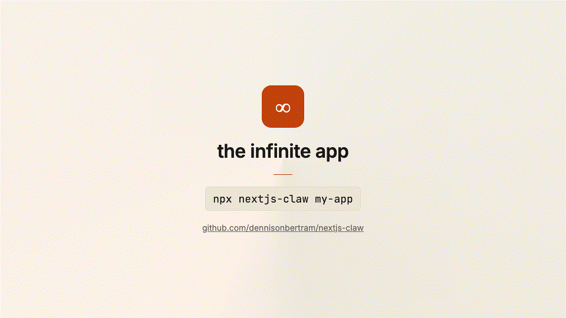
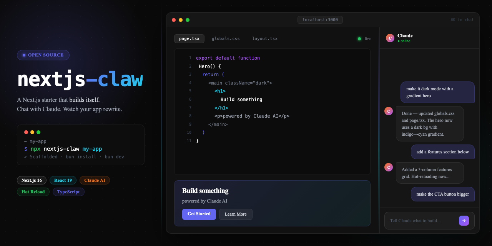

# nextjs-claw





[](https://www.npmjs.com/package/nextjs-claw)
[](./LICENSE)

A Next.js starter that builds itself. Chat with Claude inside the running app, and it edits its own source code and hot-reloads in real time.

## Usage

```bash
npx nextjs-claw my-app
cd my-app
bun install
bun dev
```

Then open [http://localhost:3000](http://localhost:3000) and start chatting.

## What you get

**Core stack**

- Next.js 16 + React 19 + Tailwind CSS 4
- TypeScript and ESLint — pre-configured, no setup required
- An AI chat panel wired directly to the `claude` CLI subprocess
- Live hot-reload: Claude edits source files and Next.js fast-refreshes them instantly

**Click-to-reference element picker**

Enter pick mode and click any element in the live preview. The picker captures the DOM context — text content, CSS classes, and the inferred component path — and sends it to Claude. Claude can surgically target the exact element without guessing.

**Resizable panel with snap points**

The chat panel snaps between four modes: rail (56 px, icon-only), default (420 px), wide (620 px), and full-screen. Free-drag resize is also supported. The panel stays out of your way when you want to see the preview, and expands when you need it.

**Real-time SSE streaming**

Claude's responses stream token-by-token via Server-Sent Events. Tool calls — file reads, writes, searches — display live status indicators so you can follow along as Claude works.

**Session persistence**

Conversations are tracked with session IDs. Claude retains context across messages within a session, so you can iterate without re-explaining your intent.

**Protected infrastructure**

Claude can only touch your app's source files (`app/preview/` and `public/`). The shell, chat panel, API routes, and config are on an allowlist that Claude cannot modify. You can build freely without worrying about Claude accidentally breaking the scaffolding.

**Stack recipes**

16 built-in architecture recipes in `docs/stack/` covering the full production stack. Ask Claude to "add auth" or "add a background job queue" and it reads the relevant recipe before writing a single line.

## Stack recipes

The `docs/stack/` cookbook contains opinionated, self-hosted recipes. The design principle: you own the stack. Postgres rather than Supabase, home-grown sessions rather than Clerk, SMTP rather than a SaaS email vendor. npm packages are fine; proprietary lock-in is not the default.

| Recipe | Topic | Key deps |
|--------|-------|----------|
| `00-overview.md` | Design philosophy, Docker Compose dev services, env-var contract | — |
| `01-database.md` | Postgres + Drizzle ORM | `drizzle-orm`, `pg`, `drizzle-kit` |
| `02-auth.md` | Sessions, passwords, OAuth | `@node-rs/argon2` |
| `03-email.md` | SMTP via Nodemailer | `nodemailer` |
| `04-cache-and-sessions.md` | Redis cache + rate limiting | `ioredis` |
| `05-background-jobs.md` | pg-boss job queue | `pg-boss` |
| `06-file-uploads.md` | Local disk → MinIO presigned uploads | `@aws-sdk/client-s3` |
| `07-realtime.md` | SSE → WebSockets → LISTEN/NOTIFY | `ws` |
| `08-validation-and-forms.md` | Zod + react-hook-form | `zod`, `react-hook-form` |
| `09-logging-and-observability.md` | Pino structured logs | `pino`, `pino-pretty` |
| `10-rate-limiting.md` | Postgres or Redis sliding window | — |
| `11-security-headers-and-csrf.md` | Middleware security headers + CSRF | — |
| `12-payments.md` | Stripe | `stripe` |
| `13-testing.md` | Vitest + Playwright | `vitest`, `@playwright/test` |
| `14-deployment.md` | Docker Compose prod + Caddy HTTPS | — |
| `15-agent-integration.md` | How the embedded agent uses this cookbook | — |

## Prerequisites

**Bun** — the package manager used by the generated app.
Install from [https://bun.sh](https://bun.sh).

**Claude Code CLI** — the AI engine that edits the source.

```bash
npm i -g @anthropic-ai/claude-code
claude login
```

The app calls `claude` as a subprocess and uses your existing Claude subscription. No API key is required.

## How it works

When you send a message in the chat panel, the app streams it to the `claude` CLI as a subprocess. Claude has read/write access to the project's editable zone and can call any of its built-in tools: reading files, writing files, running shell commands, and searching across the codebase. Changes land on disk, Next.js detects them, and the preview hot-reloads — usually within a second or two of Claude finishing a write.

The SSE endpoint on the server forwards each streamed token and tool-call event to the browser, so you see exactly what Claude is doing in real time: which files it reads, what it writes, and whether a tool call succeeded.

## Architecture

The project uses a two-zone model:

**Shell (read-only)** — the chat panel, the SSE API route, the element picker, and all configuration files. These are on a protected-path allowlist. Claude cannot modify them, even if instructed to.

**Preview zone (Claude-editable)** — `app/preview/` and `public/`. Everything Claude builds for your app lives here. This boundary means the scaffolding is stable regardless of what you ask Claude to do.

When you run `npx nextjs-claw`, you get both zones pre-wired. The shell is complete and unchanging; the preview zone starts empty, ready for Claude to fill in.

## Options

```bash
npx nextjs-claw <directory>   # scaffold into <directory>
npx nextjs-claw .             # scaffold into current directory (must be empty)
npx nextjs-claw               # defaults to ./my-infinite-app
```

## License

MIT
