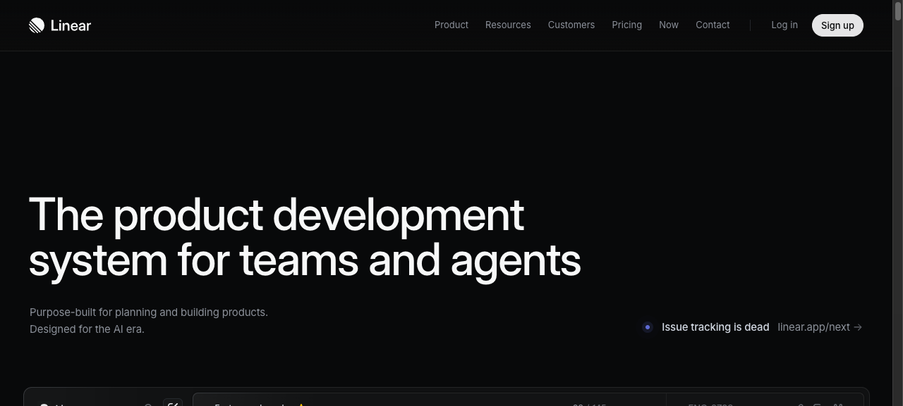
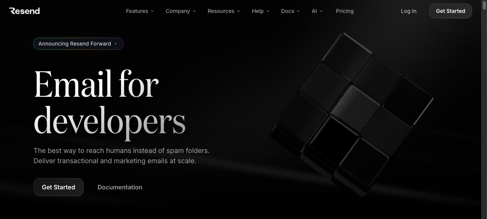

# 01 — SaaS Landing Page

## What this gives you

A high-conversion product landing page for a software-as-a-service or developer tool. The page opens with a mesh-gradient hero, flows through a trusted logo bar, a three-column feature grid, a metrics/social-proof band, a full-width testimonials row, a pricing teaser, and a closing CTA — all in a dark, neutral-950 palette with an indigo accent. The visual language borrows from Linear, Vercel, and Resend: crisp typography, generous whitespace, and restrained animation (hover states only — no page-load animations to preserve perceived performance).

## Visual reference




Inspiration URLs (confirmed live 2026-04-23):
- https://linear.app — hero mesh gradient, feature grid, testimonials carousel
- https://resend.com — code-snippet feature block, dark palette, logo bar
- https://vercel.com/templates — card density, feature-benefit copy pattern

## Design tokens

- **Palette:** `neutral-950` bg, `neutral-100` primary fg, `neutral-400` muted fg, `indigo-500` accent, `indigo-400` accent hover, `neutral-800` card bg, `neutral-700` card border
- **Typography:** `text-5xl lg:text-7xl font-semibold tracking-tight` for h1; `text-xl text-neutral-400 leading-relaxed` for subhead; `font-mono text-sm` for labels/badges
- **Key ideas:**
  - Mesh gradient: two radial gradients (indigo + violet) layered on `neutral-950`, blurred with `blur-3xl` inside an `overflow-hidden` wrapper
  - `tracking-tight` on all headings (modern SaaS feel); normal tracking on body
  - Cards use `bg-neutral-900 border border-neutral-800 rounded-2xl` — subtle, not harsh
  - Logo bar uses `grayscale opacity-40 hover:opacity-70 transition` for partner logos
  - Section rhythm: 24px between sections on mobile, 96px on desktop (`py-24`)

## Sections (in order)

1. **Navbar** — sticky, blurred (`backdrop-blur-md bg-neutral-950/80`), logo left, nav links center, CTA button right
2. **Hero** — full-viewport-height, mesh gradient, `<h1>` 64–80px, sub-headline, two CTA buttons (primary filled, secondary ghost), screenshot/UI mockup below (mock iframe or image)
3. **Logo bar** — "Trusted by teams at" label + 6 grayscale company logos in a scrolling row
4. **Features (3-col grid)** — icon + title + one-sentence benefit; 6 features; stacks to 1-col on mobile
5. **Metrics band** — full-width dark stripe with 3–4 large numbers ("10M+ emails sent", "99.99% uptime")
6. **Testimonials** — 3 card grid, avatar + name + role + pull quote
7. **Pricing preview** — 3-tier card grid with most popular highlighted, features list, CTA per tier
8. **CTA band** — centered h2, subtext, single email/signup input or primary button
9. **Footer** — 4-col grid, logo + tagline, product links, company links, legal

## Files the agent creates

- `app/preview/page.tsx` — full replacement with all sections
- `app/preview/layout.tsx` — update title to product name
- `app/preview/globals.css` — mesh gradient keyframes if animated; otherwise just `@import "tailwindcss"`

## Code

### `app/preview/layout.tsx`

```tsx
import type { Metadata } from 'next';
import './globals.css';

export const metadata: Metadata = {
  title: 'Foundry — Ship faster, together',
  description: 'The collaborative platform for high-velocity engineering teams.',
};

export default function PreviewLayout({ children }: { children: React.ReactNode }) {
  return (
    <html lang="en" className="dark">
      <body className="bg-neutral-950 text-neutral-100 antialiased">{children}</body>
    </html>
  );
}
```

### `app/preview/globals.css`

```css
@import "tailwindcss";

@theme {
  --font-sans: ui-sans-serif, system-ui, -apple-system, sans-serif;
  --font-mono: ui-monospace, 'Cascadia Code', monospace;
}
```

### `app/preview/page.tsx`

```tsx
export default function SaaSLanding() {
  return (
    <div className="min-h-screen bg-neutral-950 text-neutral-100">
      {/* Navbar */}
      <header className="sticky top-0 z-50 border-b border-neutral-800/60 backdrop-blur-md bg-neutral-950/80">
        <nav className="max-w-7xl mx-auto px-6 h-16 flex items-center justify-between">
          <a href="#" className="flex items-center gap-2 text-neutral-100 font-semibold text-lg">
            <svg width="24" height="24" viewBox="0 0 24 24" fill="none" aria-hidden="true">
              <rect width="10" height="10" rx="2" fill="#6366f1"/>
              <rect x="12" y="2" width="10" height="10" rx="2" fill="#818cf8" opacity="0.6"/>
              <rect x="6" y="12" width="10" height="10" rx="2" fill="#4f46e5" opacity="0.8"/>
            </svg>
            Foundry
          </a>
          <ul className="hidden md:flex items-center gap-8 text-sm text-neutral-400">
            <li><a href="#features" className="hover:text-neutral-100 transition-colors">Features</a></li>
            <li><a href="#pricing" className="hover:text-neutral-100 transition-colors">Pricing</a></li>
            <li><a href="#docs" className="hover:text-neutral-100 transition-colors">Docs</a></li>
            <li><a href="#blog" className="hover:text-neutral-100 transition-colors">Blog</a></li>
          </ul>
          <div className="flex items-center gap-3">
            <a href="#" className="hidden sm:inline text-sm text-neutral-400 hover:text-neutral-100 transition-colors">Sign in</a>
            <a
              href="#"
              className="inline-flex items-center gap-1.5 bg-indigo-600 hover:bg-indigo-500 text-white text-sm font-medium px-4 py-2 rounded-lg transition-colors"
            >
              Get started free
            </a>
          </div>
        </nav>
      </header>

      {/* Hero */}
      <section className="relative overflow-hidden pt-24 pb-32 px-6">
        {/* Mesh gradient blobs */}
        <div className="absolute inset-0 -z-10 overflow-hidden">
          <div className="absolute top-0 left-1/2 -translate-x-1/2 w-[900px] h-[500px] rounded-full bg-indigo-600/20 blur-3xl" />
          <div className="absolute top-32 left-1/4 w-[400px] h-[400px] rounded-full bg-violet-600/15 blur-3xl" />
          <div className="absolute top-16 right-1/4 w-[350px] h-[350px] rounded-full bg-blue-600/10 blur-3xl" />
        </div>
        <div className="max-w-5xl mx-auto text-center">
          <span className="inline-flex items-center gap-2 bg-indigo-500/10 border border-indigo-500/20 text-indigo-400 text-xs font-mono px-3 py-1.5 rounded-full mb-8">
            <span className="w-1.5 h-1.5 rounded-full bg-indigo-400 animate-pulse" />
            Now in public beta — join 12,000+ engineers
          </span>
          <h1 className="text-5xl sm:text-6xl lg:text-7xl font-semibold tracking-tight text-neutral-50 mb-6 leading-[1.05]">
            Build, ship, and iterate<br className="hidden md:block" />
            <span className="text-indigo-400"> without the noise</span>
          </h1>
          <p className="text-lg sm:text-xl text-neutral-400 max-w-2xl mx-auto mb-10 leading-relaxed">
            Foundry is the engineering platform that collapses your toolchain into one fast,
            keyboard-first workspace. Plan sprints, review code, and ship — all in the same tab.
          </p>
          <div className="flex flex-col sm:flex-row items-center justify-center gap-4">
            <a
              href="#"
              className="w-full sm:w-auto inline-flex items-center justify-center bg-indigo-600 hover:bg-indigo-500 text-white font-medium px-6 py-3 rounded-xl text-base transition-colors shadow-lg shadow-indigo-900/40"
            >
              Start for free
            </a>
            <a
              href="#"
              className="w-full sm:w-auto inline-flex items-center justify-center bg-neutral-800/60 hover:bg-neutral-700/60 border border-neutral-700 text-neutral-200 font-medium px-6 py-3 rounded-xl text-base transition-colors"
            >
              View live demo
              <svg className="ml-2 w-4 h-4" viewBox="0 0 16 16" fill="none" aria-hidden="true">
                <path d="M3 8h10M9 4l4 4-4 4" stroke="currentColor" strokeWidth="1.5" strokeLinecap="round" strokeLinejoin="round"/>
              </svg>
            </a>
          </div>
          {/* Product mockup */}
          <div className="mt-16 relative mx-auto max-w-4xl">
            <div className="absolute -inset-4 bg-indigo-600/5 rounded-3xl blur-xl" />
            <div className="relative bg-neutral-900 border border-neutral-800 rounded-2xl overflow-hidden shadow-2xl">
              {/* Mock browser chrome */}
              <div className="flex items-center gap-2 px-4 py-3 border-b border-neutral-800 bg-neutral-950/60">
                <span className="w-3 h-3 rounded-full bg-neutral-700" />
                <span className="w-3 h-3 rounded-full bg-neutral-700" />
                <span className="w-3 h-3 rounded-full bg-neutral-700" />
                <span className="flex-1 mx-4 bg-neutral-800 rounded text-neutral-600 text-xs px-3 py-1">app.foundry.dev/projects</span>
              </div>
              {/* Mock UI content */}
              <div className="grid grid-cols-12 h-64 sm:h-80">
                <div className="col-span-3 border-r border-neutral-800 p-4 space-y-2">
                  {['Dashboard', 'Issues', 'Cycles', 'Projects', 'Views', 'Inbox'].map((item, i) => (
                    <div key={item} className={`flex items-center gap-2 px-2 py-1.5 rounded text-xs ${i === 0 ? 'bg-indigo-600/20 text-indigo-300' : 'text-neutral-500'}`}>
                      <div className="w-3 h-3 rounded-sm bg-neutral-700" />
                      {item}
                    </div>
                  ))}
                </div>
                <div className="col-span-9 p-4">
                  <div className="space-y-2">
                    {[0.7, 0.4, 0.6, 0.5, 0.8].map((w, i) => (
                      <div key={i} className="flex items-center gap-3">
                        <div className="w-4 h-4 rounded border border-neutral-700 flex-shrink-0" />
                        <div className={`h-3 bg-neutral-800 rounded`} style={{ width: `${w * 100}%` }} />
                        <div className="ml-auto w-16 h-5 rounded-full bg-neutral-800" />
                      </div>
                    ))}
                  </div>
                </div>
              </div>
            </div>
          </div>
        </div>
      </section>

      {/* Logo bar */}
      <section className="border-y border-neutral-800/60 py-12 px-6">
        <div className="max-w-5xl mx-auto">
          <p className="text-center text-xs font-mono text-neutral-600 uppercase tracking-widest mb-8">
            Trusted by engineering teams at
          </p>
          <div className="flex flex-wrap items-center justify-center gap-x-12 gap-y-6">
            {['Axiom', 'Harbor Labs', 'Vault AI', 'Meridian', 'Crestline', 'Nexus'].map((name) => (
              <span
                key={name}
                className="text-neutral-600 hover:text-neutral-400 transition-colors font-semibold text-sm tracking-wide cursor-default"
              >
                {name}
              </span>
            ))}
          </div>
        </div>
      </section>

      {/* Features */}
      <section id="features" className="py-24 px-6">
        <div className="max-w-7xl mx-auto">
          <div className="text-center mb-16">
            <h2 className="text-3xl sm:text-4xl font-semibold tracking-tight text-neutral-50 mb-4">
              Everything your team needs
            </h2>
            <p className="text-neutral-400 text-lg max-w-2xl mx-auto">
              We cut the ceremony and kept the signal. Here's what that looks like in practice.
            </p>
          </div>
          <div className="grid grid-cols-1 md:grid-cols-2 lg:grid-cols-3 gap-6">
            {[
              { icon: '⚡', title: 'Zero-friction issues', desc: 'Create, assign, and close issues in seconds. No fields required unless you want them.' },
              { icon: '🔁', title: 'Automated cycles', desc: 'Two-week sprints that self-populate from your backlog based on team velocity and priority.' },
              { icon: '🔍', title: 'Cross-repo search', desc: 'Find any commit, PR, issue, or comment across all your repos in under 100ms.' },
              { icon: '🛡️', title: 'Branch protection rules', desc: 'Code review policies that enforce quality without slowing down your fastest engineers.' },
              { icon: '📊', title: 'Velocity analytics', desc: 'Understand where time goes — by engineer, team, project, or quarter. No spreadsheets.' },
              { icon: '🤝', title: 'Async standups', desc: 'Replace daily syncs with structured async updates that everyone reads on their schedule.' },
            ].map(({ icon, title, desc }) => (
              <div
                key={title}
                className="bg-neutral-900 border border-neutral-800 rounded-2xl p-6 hover:border-neutral-700 transition-colors group"
              >
                <div className="text-2xl mb-4 w-10 h-10 rounded-xl bg-neutral-800 flex items-center justify-center group-hover:bg-indigo-600/20 transition-colors">
                  {icon}
                </div>
                <h3 className="text-neutral-100 font-medium mb-2">{title}</h3>
                <p className="text-neutral-500 text-sm leading-relaxed">{desc}</p>
              </div>
            ))}
          </div>
        </div>
      </section>

      {/* Metrics band */}
      <section className="bg-neutral-900/50 border-y border-neutral-800/60 py-16 px-6">
        <div className="max-w-5xl mx-auto grid grid-cols-2 md:grid-cols-4 gap-8 text-center">
          {[
            { value: '12k+', label: 'Engineering teams' },
            { value: '340M', label: 'Issues tracked' },
            { value: '99.97%', label: 'Uptime SLA' },
            { value: '<80ms', label: 'Median API latency' },
          ].map(({ value, label }) => (
            <div key={label}>
              <div className="text-3xl sm:text-4xl font-semibold text-indigo-400 tracking-tight mb-1">{value}</div>
              <div className="text-sm text-neutral-500">{label}</div>
            </div>
          ))}
        </div>
      </section>

      {/* Testimonials */}
      <section className="py-24 px-6">
        <div className="max-w-7xl mx-auto">
          <h2 className="text-3xl font-semibold tracking-tight text-center text-neutral-50 mb-12">
            What teams say
          </h2>
          <div className="grid grid-cols-1 md:grid-cols-3 gap-6">
            {[
              {
                quote: "We dropped Jira and Linear and consolidated onto Foundry in a week. Sprint velocity went up 30% — mostly because engineers stopped context-switching between tools.",
                name: 'Priya Mehta',
                role: 'VP Engineering, Axiom',
                initials: 'PM',
              },
              {
                quote: "The cross-repo search alone saved us. We have 200+ microservices and finding where a bug lives used to take an hour. Now it takes ten seconds.",
                name: 'Carlos Reyes',
                role: 'Staff Engineer, Meridian',
                initials: 'CR',
              },
              {
                quote: "Async standups changed our culture more than any management process. Everyone reads them. No one misses them. Nobody has to stay late for a sync.",
                name: 'Yuki Tanaka',
                role: 'Engineering Manager, Harbor Labs',
                initials: 'YT',
              },
            ].map(({ quote, name, role, initials }) => (
              <div key={name} className="bg-neutral-900 border border-neutral-800 rounded-2xl p-6 flex flex-col gap-4">
                <svg className="text-indigo-500 w-6 h-6 flex-shrink-0" viewBox="0 0 24 24" fill="currentColor" aria-hidden="true">
                  <path d="M14.017 21v-7.391c0-5.704 3.731-9.57 8.983-10.609l.995 2.151c-2.432.917-3.995 3.638-3.995 5.849h4v10h-9.983zm-14.017 0v-7.391c0-5.704 3.748-9.57 9-10.609l.996 2.151c-2.433.917-3.996 3.638-3.996 5.849h3.983v10h-9.983z"/>
                </svg>
                <p className="text-neutral-300 text-sm leading-relaxed flex-1">{quote}</p>
                <div className="flex items-center gap-3">
                  <div className="w-8 h-8 rounded-full bg-indigo-600/20 border border-indigo-500/30 flex items-center justify-center text-xs font-medium text-indigo-400">
                    {initials}
                  </div>
                  <div>
                    <div className="text-sm font-medium text-neutral-200">{name}</div>
                    <div className="text-xs text-neutral-500">{role}</div>
                  </div>
                </div>
              </div>
            ))}
          </div>
        </div>
      </section>

      {/* Pricing preview */}
      <section id="pricing" className="py-24 px-6 bg-neutral-900/30">
        <div className="max-w-6xl mx-auto">
          <div className="text-center mb-12">
            <h2 className="text-3xl sm:text-4xl font-semibold tracking-tight text-neutral-50 mb-4">
              Simple, transparent pricing
            </h2>
            <p className="text-neutral-400">Start free. Scale when you're ready.</p>
          </div>
          <div className="grid grid-cols-1 md:grid-cols-3 gap-6">
            {[
              {
                tier: 'Free',
                price: '$0',
                desc: 'For solo engineers and tiny teams.',
                features: ['Up to 3 members', '10 active projects', 'Basic analytics', 'Community support'],
                cta: 'Start free',
                highlight: false,
              },
              {
                tier: 'Pro',
                price: '$18',
                desc: 'For growing teams that need more power.',
                features: ['Unlimited members', 'Unlimited projects', 'Advanced analytics', 'Priority support', 'Custom workflows', 'API access'],
                cta: 'Start free trial',
                highlight: true,
              },
              {
                tier: 'Enterprise',
                price: 'Custom',
                desc: 'For large orgs with compliance needs.',
                features: ['SSO / SAML', 'Audit logs', 'Custom SLA', 'Dedicated CSM', 'On-prem option'],
                cta: 'Talk to sales',
                highlight: false,
              },
            ].map(({ tier, price, desc, features, cta, highlight }) => (
              <div
                key={tier}
                className={`rounded-2xl p-6 flex flex-col gap-5 ${
                  highlight
                    ? 'bg-indigo-600 border border-indigo-500 shadow-xl shadow-indigo-900/40'
                    : 'bg-neutral-900 border border-neutral-800'
                }`}
              >
                {highlight && (
                  <span className="inline-flex self-start text-xs font-mono bg-white/20 text-white px-2.5 py-1 rounded-full">
                    Most popular
                  </span>
                )}
                <div>
                  <div className={`text-sm font-medium mb-1 ${highlight ? 'text-indigo-200' : 'text-neutral-400'}`}>{tier}</div>
                  <div className={`text-4xl font-semibold tracking-tight ${highlight ? 'text-white' : 'text-neutral-50'}`}>
                    {price}
                    {price !== 'Custom' && <span className={`text-lg font-normal ${highlight ? 'text-indigo-200' : 'text-neutral-500'}`}>/mo</span>}
                  </div>
                  <p className={`text-sm mt-1 ${highlight ? 'text-indigo-200' : 'text-neutral-500'}`}>{desc}</p>
                </div>
                <ul className="space-y-2 flex-1">
                  {features.map((f) => (
                    <li key={f} className={`flex items-center gap-2 text-sm ${highlight ? 'text-indigo-100' : 'text-neutral-400'}`}>
                      <svg className={`w-4 h-4 flex-shrink-0 ${highlight ? 'text-white' : 'text-indigo-500'}`} viewBox="0 0 16 16" fill="none" aria-hidden="true">
                        <path d="M3 8l3.5 3.5 6.5-7" stroke="currentColor" strokeWidth="1.5" strokeLinecap="round" strokeLinejoin="round"/>
                      </svg>
                      {f}
                    </li>
                  ))}
                </ul>
                <a
                  href="#"
                  className={`block text-center text-sm font-medium py-2.5 rounded-lg transition-colors ${
                    highlight
                      ? 'bg-white text-indigo-700 hover:bg-indigo-50'
                      : 'bg-neutral-800 hover:bg-neutral-700 text-neutral-100 border border-neutral-700'
                  }`}
                >
                  {cta}
                </a>
              </div>
            ))}
          </div>
        </div>
      </section>

      {/* CTA band */}
      <section className="py-24 px-6">
        <div className="max-w-3xl mx-auto text-center">
          <h2 className="text-3xl sm:text-4xl font-semibold tracking-tight text-neutral-50 mb-4">
            Ready to ship without the overhead?
          </h2>
          <p className="text-neutral-400 mb-8 text-lg">
            Join 12,000+ teams. Set up in under five minutes. No credit card required.
          </p>
          <form
            className="flex flex-col sm:flex-row gap-3 max-w-md mx-auto"
            onSubmit={(e) => e.preventDefault()}
          >
            <input
              type="email"
              placeholder="you@company.com"
              className="flex-1 bg-neutral-900 border border-neutral-700 rounded-xl px-4 py-3 text-sm text-neutral-100 placeholder:text-neutral-600 focus:outline-none focus:border-indigo-500"
            />
            <button
              type="submit"
              className="bg-indigo-600 hover:bg-indigo-500 text-white font-medium px-6 py-3 rounded-xl text-sm transition-colors whitespace-nowrap"
            >
              Get started free
            </button>
          </form>
        </div>
      </section>

      {/* Footer */}
      <footer className="border-t border-neutral-800/60 py-16 px-6">
        <div className="max-w-7xl mx-auto grid grid-cols-2 md:grid-cols-4 gap-8">
          <div className="col-span-2 md:col-span-1">
            <div className="flex items-center gap-2 font-semibold text-neutral-100 mb-3">
              <svg width="20" height="20" viewBox="0 0 24 24" fill="none" aria-hidden="true">
                <rect width="10" height="10" rx="2" fill="#6366f1"/>
                <rect x="12" y="2" width="10" height="10" rx="2" fill="#818cf8" opacity="0.6"/>
                <rect x="6" y="12" width="10" height="10" rx="2" fill="#4f46e5" opacity="0.8"/>
              </svg>
              Foundry
            </div>
            <p className="text-neutral-500 text-sm leading-relaxed">
              The engineering platform for teams that ship.
            </p>
          </div>
          {[
            { heading: 'Product', links: ['Features', 'Pricing', 'Changelog', 'Roadmap', 'API docs'] },
            { heading: 'Company', links: ['About', 'Blog', 'Careers', 'Press', 'Contact'] },
            { heading: 'Legal', links: ['Privacy', 'Terms', 'Security', 'Cookies'] },
          ].map(({ heading, links }) => (
            <div key={heading}>
              <h4 className="text-xs font-mono text-neutral-600 uppercase tracking-widest mb-4">{heading}</h4>
              <ul className="space-y-2.5">
                {links.map((link) => (
                  <li key={link}>
                    <a href="#" className="text-sm text-neutral-500 hover:text-neutral-300 transition-colors">{link}</a>
                  </li>
                ))}
              </ul>
            </div>
          ))}
        </div>
        <div className="max-w-7xl mx-auto mt-12 pt-6 border-t border-neutral-800/60 flex flex-col sm:flex-row items-center justify-between gap-3">
          <p className="text-xs text-neutral-600">© 2026 Foundry, Inc. All rights reserved.</p>
          <p className="text-xs text-neutral-600">Made with care in San Francisco</p>
        </div>
      </footer>
    </div>
  );
}
```

## Integration hook — how the embedded agent invokes this

When the user asks for "a SaaS landing page", "product landing", "startup page", or "marketing site", follow `docs/templates/01-saas-landing.md`: replace `app/preview/page.tsx` with the provided code; update `app/preview/layout.tsx` title/description to match the user's product name; optionally update `app/preview/globals.css` if the user wants a different accent color (swap `indigo` for the desired hue).

## Variations

- **Light mode:** Change `bg-neutral-950` to `bg-white`, `text-neutral-100` to `text-neutral-900`, `bg-neutral-900` cards to `bg-neutral-50`, update border colors to `neutral-200`. The indigo accent reads well on both.
- **Gradient hero alternative:** Replace the mesh blobs with a CSS gradient: `background: linear-gradient(135deg, #1e1b4b 0%, #0f172a 50%, #0a0a0a 100%)` on the hero section for a simpler, more controlled look.
- **Video background hero:** Replace the product mockup block with a `<video autoPlay muted loop playsInline>` element and a dark overlay — works well for product demos or screen recordings.

## Common pitfalls

- Unsplash image URLs must include `?w=1280&q=80` query params or they serve the full-res original (often 8–20MB). Always append dimensions.
- The mesh gradient blobs use absolute positioning inside `overflow-hidden` — if you remove `overflow-hidden` from the hero wrapper, the blobs will bleed into the next section.
- `tracking-tight` on the `<h1>` looks right at `text-5xl` and above; at `text-base` it makes text unreadable — never apply it to body copy.
- The feature grid uses `grid-cols-1 md:grid-cols-2 lg:grid-cols-3` — skipping the `md` breakpoint makes the jump from 1→3 columns jarring on tablets.
- The pricing card's "Most popular" badge uses `self-start` — without it the `inline-flex` badge stretches full width in a flex column layout.
- The sticky navbar uses `z-50` — if you add a sticky section header inside the page, give it `z-40` or lower, or they'll overlap.
