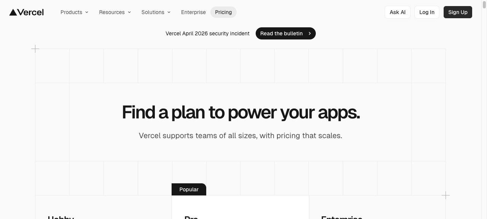
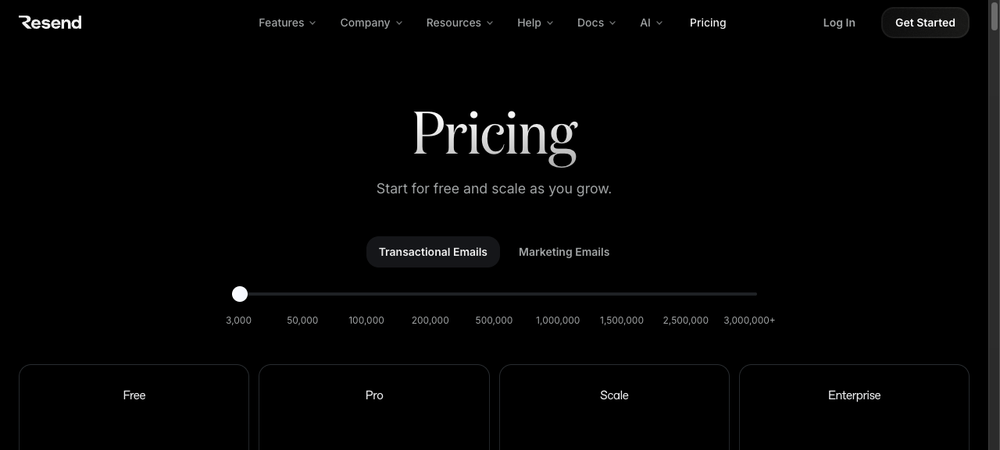

# 02 — Pricing Page

## What this gives you

A standalone pricing page with three plan tiers, a feature comparison table, an FAQ accordion, and a money-back guarantee CTA band. Designed to be dropped as a route (`/pricing`) inside any SaaS product. The visual language is clean dark-neutral: the middle tier is highlighted in indigo to guide the eye, the comparison table uses alternating row shading for readability, and the FAQ uses a no-JS accordion pattern (CSS-only `details`/`summary` elements for progressive enhancement — works without client-side JS, upgrades with it).

## Visual reference




Inspiration URLs (confirmed live 2026-04-23):
- https://vercel.com/pricing — highlighted middle tier, feature matrix, enterprise row
- https://resend.com/pricing — per-unit pricing clarity, free tier emphasis, usage calculator pattern
- https://linear.app/pricing — flat monthly/annual toggle, copy-forward tier descriptions

## Design tokens

- **Palette:** `neutral-950` bg, `neutral-100` fg, `indigo-600` highlight tier, `neutral-800` card bg, `neutral-700` card border, `emerald-500` checkmark accent
- **Typography:** `text-4xl font-semibold tracking-tight` h1; `text-5xl font-bold tracking-tighter` price numbers; `text-sm text-neutral-400` feature labels in comparison table
- **Key ideas:**
  - The "Most popular" tier casts a visible `shadow-indigo-900/60` glow — not just a border change
  - Annual/monthly toggle with a subtle pill slider (CSS transform, no JS state needed for static page)
  - Comparison table collapses to three separate feature-list cards on mobile (`hidden md:table`)
  - FAQ uses native `<details>`/`<summary>` — no state management, fully accessible

## Sections (in order)

1. **Navbar** — minimal, links to product home, docs, login
2. **Hero** — `<h1>` + subtitle + annual/monthly toggle, centered
3. **Pricing cards (3-col)** — Free / Pro / Enterprise, highlighted Pro
4. **Feature comparison table** — sticky header row, grouped feature categories, checkmarks
5. **FAQ** — 6–8 questions in two columns, `<details>` accordion
6. **Money-back CTA** — "30-day money-back guarantee" with a single CTA button
7. **Footer** — minimal, single row

## Files the agent creates

- `app/preview/page.tsx` — full page
- `app/preview/layout.tsx` — title update
- `app/preview/globals.css` — base styles

## Code

### `app/preview/layout.tsx`

```tsx
import type { Metadata } from 'next';
import './globals.css';

export const metadata: Metadata = {
  title: 'Pricing — Harbor',
  description: 'Simple, transparent pricing for teams of all sizes.',
};

export default function PreviewLayout({ children }: { children: React.ReactNode }) {
  return (
    <html lang="en">
      <body className="bg-neutral-950 text-neutral-100 antialiased">{children}</body>
    </html>
  );
}
```

### `app/preview/globals.css`

```css
@import "tailwindcss";

@theme {
  --font-sans: ui-sans-serif, system-ui, -apple-system, sans-serif;
}

details > summary {
  list-style: none;
  cursor: pointer;
}
details > summary::-webkit-details-marker {
  display: none;
}
details[open] .faq-chevron {
  transform: rotate(180deg);
}
```

### `app/preview/page.tsx`

```tsx
const plans = [
  {
    name: 'Free',
    monthlyPrice: '$0',
    annualPrice: '$0',
    description: 'Everything you need to get started.',
    cta: 'Start for free',
    ctaVariant: 'secondary' as const,
    features: ['Up to 5 seats', '3 projects', '1 GB storage', 'Email support', 'Basic analytics'],
  },
  {
    name: 'Pro',
    monthlyPrice: '$24',
    annualPrice: '$19',
    description: 'For growing teams that want more control.',
    cta: 'Start free trial',
    ctaVariant: 'primary' as const,
    badge: 'Most popular',
    features: ['Unlimited seats', 'Unlimited projects', '100 GB storage', 'Priority support', 'Advanced analytics', 'Custom domains', 'API access', 'Audit logs'],
  },
  {
    name: 'Enterprise',
    monthlyPrice: 'Custom',
    annualPrice: 'Custom',
    description: 'Compliance, SLAs, and white-glove support.',
    cta: 'Talk to sales',
    ctaVariant: 'secondary' as const,
    features: ['Everything in Pro', 'SSO / SAML', 'Dedicated CSM', 'SLA guarantee', 'Custom contracts', 'On-prem option'],
  },
];

const comparisonFeatures = [
  {
    category: 'Usage',
    rows: [
      { label: 'Seats',            free: 'Up to 5',         pro: 'Unlimited',        enterprise: 'Unlimited' },
      { label: 'Projects',         free: '3',               pro: 'Unlimited',        enterprise: 'Unlimited' },
      { label: 'Storage',          free: '1 GB',            pro: '100 GB',           enterprise: 'Custom' },
      { label: 'API requests/mo',  free: '10k',             pro: '1M',               enterprise: 'Unlimited' },
    ],
  },
  {
    category: 'Collaboration',
    rows: [
      { label: 'Custom domains',   free: false,             pro: true,               enterprise: true },
      { label: 'Audit logs',       free: false,             pro: true,               enterprise: true },
      { label: 'Team roles',       free: 'View / Edit',     pro: 'Full RBAC',        enterprise: 'Full RBAC' },
    ],
  },
  {
    category: 'Security',
    rows: [
      { label: 'SSO / SAML',       free: false,             pro: false,              enterprise: true },
      { label: '2FA enforcement',  free: false,             pro: true,               enterprise: true },
      { label: 'SOC 2 Type II',    free: false,             pro: false,              enterprise: true },
    ],
  },
  {
    category: 'Support',
    rows: [
      { label: 'Support channel',  free: 'Community',       pro: 'Email + chat',     enterprise: 'Dedicated CSM' },
      { label: 'SLA',              free: 'None',            pro: '99.9% uptime',     enterprise: 'Custom SLA' },
    ],
  },
];

const faqs = [
  {
    q: 'Can I change plans at any time?',
    a: 'Yes. Upgrades take effect immediately and are prorated to the day. Downgrades take effect at the end of your current billing period.',
  },
  {
    q: 'What payment methods do you accept?',
    a: 'We accept all major credit cards (Visa, Mastercard, Amex) and ACH bank transfers for annual enterprise plans. All payments are processed by Stripe.',
  },
  {
    q: 'Is there a free trial on the Pro plan?',
    a: 'Yes — 14 days, no credit card required. At the end of the trial you can continue with a free plan or enter payment details to keep your Pro features.',
  },
  {
    q: 'How does the per-seat pricing work?',
    a: 'Pro is billed per active seat per month. A seat is any user who logged in during the billing period. Invited but never-logged-in users don\'t count.',
  },
  {
    q: 'Do you offer discounts for startups or nonprofits?',
    a: 'Yes. Qualifying early-stage startups (under $2M raised, under 2 years old) get 50% off Pro for 12 months. Nonprofits get 30% off indefinitely. Email support to apply.',
  },
  {
    q: 'What happens to my data if I cancel?',
    a: 'We retain your data for 90 days after cancellation so you can export it. After 90 days it is permanently deleted from our systems per our retention policy.',
  },
];

function CheckIcon() {
  return (
    <svg className="w-4 h-4 text-emerald-400 flex-shrink-0" viewBox="0 0 16 16" fill="none" aria-label="Included">
      <path d="M3 8l3.5 3.5 6.5-7" stroke="currentColor" strokeWidth="1.5" strokeLinecap="round" strokeLinejoin="round"/>
    </svg>
  );
}

function XIcon() {
  return (
    <svg className="w-4 h-4 text-neutral-700 flex-shrink-0" viewBox="0 0 16 16" fill="none" aria-label="Not included">
      <path d="M4 4l8 8M12 4l-8 8" stroke="currentColor" strokeWidth="1.5" strokeLinecap="round"/>
    </svg>
  );
}

function CellValue({ value }: { value: string | boolean }) {
  if (value === true) return <CheckIcon />;
  if (value === false) return <XIcon />;
  return <span className="text-sm text-neutral-400">{value}</span>;
}

export default function PricingPage() {
  return (
    <div className="min-h-screen bg-neutral-950 text-neutral-100">
      {/* Minimal nav */}
      <header className="border-b border-neutral-800/60 backdrop-blur-md bg-neutral-950/80 sticky top-0 z-50">
        <nav className="max-w-7xl mx-auto px-6 h-16 flex items-center justify-between">
          <a href="#" className="font-semibold text-neutral-100 text-lg">Harbor</a>
          <div className="flex items-center gap-6 text-sm text-neutral-400">
            <a href="#" className="hover:text-neutral-100 transition-colors hidden sm:inline">Docs</a>
            <a href="#" className="hover:text-neutral-100 transition-colors hidden sm:inline">Blog</a>
            <a href="#" className="hover:text-neutral-100 transition-colors">Sign in</a>
          </div>
        </nav>
      </header>

      {/* Hero */}
      <section className="py-20 px-6 text-center">
        <h1 className="text-4xl sm:text-5xl font-semibold tracking-tight text-neutral-50 mb-4">
          Honest pricing, no surprises
        </h1>
        <p className="text-neutral-400 text-lg max-w-xl mx-auto mb-10">
          Start free, upgrade when your team grows. Every plan includes a 14-day trial of Pro features.
        </p>
        {/* Annual/monthly toggle — visual only for static page */}
        <div className="inline-flex items-center gap-1 bg-neutral-900 border border-neutral-800 rounded-xl p-1">
          <button className="text-sm font-medium px-4 py-2 rounded-lg bg-neutral-700 text-neutral-100 transition-colors">
            Monthly
          </button>
          <button className="text-sm font-medium px-4 py-2 rounded-lg text-neutral-400 hover:text-neutral-200 transition-colors flex items-center gap-1.5">
            Annual
            <span className="text-xs bg-emerald-500/20 text-emerald-400 px-1.5 py-0.5 rounded-full font-mono">−20%</span>
          </button>
        </div>
      </section>

      {/* Pricing cards */}
      <section className="px-6 pb-16">
        <div className="max-w-5xl mx-auto grid grid-cols-1 md:grid-cols-3 gap-6 items-start">
          {plans.map(({ name, monthlyPrice, description, cta, ctaVariant, badge, features }) => (
            <div
              key={name}
              className={`rounded-2xl p-6 flex flex-col gap-5 relative ${
                ctaVariant === 'primary'
                  ? 'bg-indigo-600 border border-indigo-500 shadow-2xl shadow-indigo-900/60'
                  : 'bg-neutral-900 border border-neutral-800'
              }`}
            >
              {badge && (
                <span className="absolute -top-3 left-1/2 -translate-x-1/2 text-xs font-mono bg-white text-indigo-700 px-3 py-1 rounded-full whitespace-nowrap">
                  {badge}
                </span>
              )}
              <div>
                <div className={`text-sm font-medium mb-2 ${ctaVariant === 'primary' ? 'text-indigo-200' : 'text-neutral-400'}`}>{name}</div>
                <div className={`font-bold tracking-tight flex items-end gap-1 ${ctaVariant === 'primary' ? 'text-white' : 'text-neutral-50'}`}>
                  <span className="text-5xl">{monthlyPrice}</span>
                  {monthlyPrice !== 'Custom' && (
                    <span className={`text-base font-normal mb-1 ${ctaVariant === 'primary' ? 'text-indigo-200' : 'text-neutral-500'}`}>/seat/mo</span>
                  )}
                </div>
                <p className={`text-sm mt-2 ${ctaVariant === 'primary' ? 'text-indigo-200' : 'text-neutral-500'}`}>{description}</p>
              </div>
              <ul className="space-y-2.5 flex-1">
                {features.map((f) => (
                  <li key={f} className={`flex items-center gap-2 text-sm ${ctaVariant === 'primary' ? 'text-indigo-100' : 'text-neutral-400'}`}>
                    <svg className={`w-4 h-4 flex-shrink-0 ${ctaVariant === 'primary' ? 'text-white' : 'text-emerald-500'}`} viewBox="0 0 16 16" fill="none" aria-hidden="true">
                      <path d="M3 8l3.5 3.5 6.5-7" stroke="currentColor" strokeWidth="1.5" strokeLinecap="round" strokeLinejoin="round"/>
                    </svg>
                    {f}
                  </li>
                ))}
              </ul>
              <a
                href="#"
                className={`block text-center text-sm font-medium py-2.5 rounded-xl transition-colors ${
                  ctaVariant === 'primary'
                    ? 'bg-white text-indigo-700 hover:bg-indigo-50'
                    : 'bg-neutral-800 hover:bg-neutral-700 text-neutral-100 border border-neutral-700'
                }`}
              >
                {cta}
              </a>
            </div>
          ))}
        </div>
      </section>

      {/* Feature comparison table */}
      <section className="py-16 px-6 border-t border-neutral-800/60">
        <div className="max-w-5xl mx-auto">
          <h2 className="text-2xl font-semibold tracking-tight text-neutral-50 mb-10 text-center">Full feature comparison</h2>
          {/* Desktop table */}
          <div className="hidden md:block overflow-x-auto">
            <table className="w-full text-sm border-collapse">
              <thead>
                <tr className="border-b border-neutral-800">
                  <th className="text-left py-3 px-4 text-neutral-500 font-normal w-1/2">Feature</th>
                  {['Free', 'Pro', 'Enterprise'].map((h) => (
                    <th key={h} className="py-3 px-4 text-center font-medium text-neutral-200 w-1/6">{h}</th>
                  ))}
                </tr>
              </thead>
              <tbody>
                {comparisonFeatures.map(({ category, rows }) => (
                  <>
                    <tr key={category} className="border-b border-neutral-800/40">
                      <td colSpan={4} className="py-3 px-4">
                        <span className="text-xs font-mono text-neutral-600 uppercase tracking-widest">{category}</span>
                      </td>
                    </tr>
                    {rows.map(({ label, free, pro, enterprise }, i) => (
                      <tr key={label} className={`border-b border-neutral-800/40 ${i % 2 === 0 ? 'bg-neutral-900/30' : ''}`}>
                        <td className="py-3 px-4 text-neutral-400">{label}</td>
                        <td className="py-3 px-4 text-center flex justify-center">
                          <CellValue value={free} />
                        </td>
                        <td className="py-3 px-4 text-center">
                          <div className="flex justify-center"><CellValue value={pro} /></div>
                        </td>
                        <td className="py-3 px-4 text-center">
                          <div className="flex justify-center"><CellValue value={enterprise} /></div>
                        </td>
                      </tr>
                    ))}
                  </>
                ))}
              </tbody>
            </table>
          </div>
          {/* Mobile: stacked cards per tier */}
          <div className="md:hidden space-y-4">
            {['Free', 'Pro', 'Enterprise'].map((tierName, ti) => {
              const key = ['free', 'pro', 'enterprise'][ti] as 'free' | 'pro' | 'enterprise';
              return (
                <div key={tierName} className="bg-neutral-900 border border-neutral-800 rounded-xl p-4">
                  <h3 className="font-medium text-neutral-200 mb-3">{tierName}</h3>
                  {comparisonFeatures.flatMap(({ rows }) =>
                    rows.map(({ label, ...vals }) => (
                      <div key={label} className="flex items-center justify-between py-1.5 border-b border-neutral-800/40 last:border-0">
                        <span className="text-sm text-neutral-500">{label}</span>
                        <CellValue value={vals[key]} />
                      </div>
                    ))
                  )}
                </div>
              );
            })}
          </div>
        </div>
      </section>

      {/* FAQ */}
      <section className="py-16 px-6 border-t border-neutral-800/60">
        <div className="max-w-5xl mx-auto">
          <h2 className="text-2xl font-semibold tracking-tight text-neutral-50 mb-10 text-center">Frequently asked questions</h2>
          <div className="grid grid-cols-1 md:grid-cols-2 gap-4">
            {faqs.map(({ q, a }) => (
              <details key={q} className="group bg-neutral-900 border border-neutral-800 rounded-xl overflow-hidden">
                <summary className="flex items-center justify-between gap-4 px-5 py-4 hover:bg-neutral-800/50 transition-colors select-none">
                  <span className="text-sm font-medium text-neutral-200">{q}</span>
                  <svg
                    className="faq-chevron w-4 h-4 text-neutral-500 flex-shrink-0 transition-transform duration-200"
                    viewBox="0 0 16 16"
                    fill="none"
                    aria-hidden="true"
                  >
                    <path d="M4 6l4 4 4-4" stroke="currentColor" strokeWidth="1.5" strokeLinecap="round" strokeLinejoin="round"/>
                  </svg>
                </summary>
                <div className="px-5 pb-4 text-sm text-neutral-400 leading-relaxed">{a}</div>
              </details>
            ))}
          </div>
        </div>
      </section>

      {/* Money-back CTA */}
      <section className="py-16 px-6 border-t border-neutral-800/60">
        <div className="max-w-2xl mx-auto text-center">
          <div className="inline-flex items-center justify-center w-14 h-14 rounded-full bg-emerald-500/10 border border-emerald-500/20 mb-6">
            <svg className="w-7 h-7 text-emerald-400" viewBox="0 0 24 24" fill="none" aria-hidden="true">
              <path d="M9 12l2 2 4-4m5.618-4.016A11.955 11.955 0 0112 2.944a11.955 11.955 0 01-8.618 3.04A12.02 12.02 0 003 9c0 5.591 3.824 10.29 9 11.622 5.176-1.332 9-6.03 9-11.622 0-1.042-.133-2.052-.382-3.016z" stroke="currentColor" strokeWidth="1.5" strokeLinecap="round" strokeLinejoin="round"/>
            </svg>
          </div>
          <h2 className="text-2xl font-semibold tracking-tight text-neutral-50 mb-3">
            30-day money-back guarantee
          </h2>
          <p className="text-neutral-400 text-base mb-8 leading-relaxed">
            If Harbor isn't right for your team in the first 30 days, email us and we'll refund your
            first payment in full — no questions, no hassle.
          </p>
          <a
            href="#"
            className="inline-flex items-center bg-indigo-600 hover:bg-indigo-500 text-white font-medium px-6 py-3 rounded-xl text-sm transition-colors shadow-lg shadow-indigo-900/40"
          >
            Start your free trial
          </a>
        </div>
      </section>

      {/* Minimal footer */}
      <footer className="border-t border-neutral-800/60 py-8 px-6">
        <div className="max-w-7xl mx-auto flex flex-col sm:flex-row items-center justify-between gap-3">
          <a href="#" className="font-semibold text-neutral-400 text-sm hover:text-neutral-100 transition-colors">Harbor</a>
          <div className="flex items-center gap-6 text-xs text-neutral-600">
            <a href="#" className="hover:text-neutral-400 transition-colors">Privacy</a>
            <a href="#" className="hover:text-neutral-400 transition-colors">Terms</a>
            <a href="#" className="hover:text-neutral-400 transition-colors">Security</a>
          </div>
          <p className="text-xs text-neutral-700">© 2026 Harbor, Inc.</p>
        </div>
      </footer>
    </div>
  );
}
```

## Integration hook — how the embedded agent invokes this

When the user asks for "a pricing page", "pricing tiers", "subscription plans page", or "show me plan options", follow `docs/templates/02-pricing-page.md`: replace `app/preview/page.tsx` with the provided code; update plan names and prices to match the user's product; update `app/preview/layout.tsx` with the product name.

## Variations

- **Annual/monthly toggle with React state:** Promote the billing interval to a `useState` hook at the top of the component; conditionally render `monthlyPrice` vs `annualPrice` from the `plans` array. The toggle button flips a boolean.
- **Two-tier layout:** Remove the Enterprise card and go full-width on Free (left) and Pro (right) — gives each tier more breathing room and works better for developer tools where enterprise deals are handled off-page.
- **Light mode:** Swap to `bg-white` / `neutral-900` text / `neutral-100` card bg — the emerald checkmarks and indigo highlights read equally well on white.

## Common pitfalls

- The feature comparison table's `<td>` with `flex justify-center` works in a table cell only because of `display: flex` — table cells default to `table-cell` so you need the explicit flex wrapper or a `<div>` inside the `<td>`.
- `<details>`/`<summary>` accordion: the `.faq-chevron` CSS rotation trick requires `details[open] .faq-chevron` in a stylesheet — Tailwind's `group-open:rotate-180` utility also works if you prefer staying in-class.
- The comparison table category rows have `colSpan={4}` — if you change the number of columns (e.g., add an "Unlimited" tier), increment `colSpan` or the category header won't span the full width.
- "Most popular" badge uses `absolute -top-3` — the parent card must have `relative` positioning or the badge escapes its intended container.
- The mobile stacked view casts `key` as `'free' | 'pro' | 'enterprise'` to index `vals` — if you rename tiers in the `plans` array, update the `comparisonFeatures` row object keys to match.
