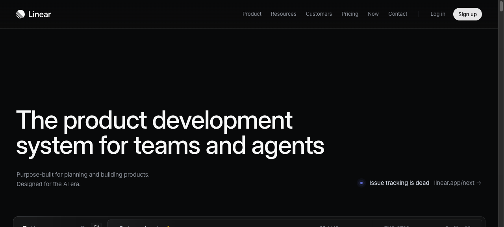

# 03 — Developer / Designer Portfolio

## What this gives you

A personal portfolio site for a software engineer, product designer, or creative technologist. Bold typographic hero with name and title, a projects grid with hover effects that reveal a short description, an about section with a skills inventory, and a contact section with links. The visual register is confident and modern — heavy kerning on the `<h1>`, a saturated accent color (violet), dark base, and monospaced detail text. Works equally well for developers and visual designers by swapping the project thumbnails.

## Visual reference



Inspiration URLs (confirmed live 2026-04-23):
- https://vercel.com/templates — project card hover patterns, minimal nav, clean grid
- https://framer.com/marketplace/templates — typography-forward personal sites, full-bleed section rhythm
- https://anthropic.com — bold headline with soft gradient, generous vertical rhythm

## Design tokens

- **Palette:** `neutral-950` bg, `neutral-50` fg, `violet-500` accent, `neutral-800` card bg, `neutral-700` border
- **Typography:** `text-6xl sm:text-8xl font-black tracking-tighter` for the display name; `font-mono text-xs text-neutral-500` for labels; `text-neutral-300 text-base leading-relaxed` body
- **Key ideas:**
  - Name in `font-black tracking-tighter` reads like a logotype at large sizes
  - Project cards: on hover, the card background shifts from `neutral-900` to `neutral-800`, and a short overlay description fades in over the project thumbnail
  - Skills listed as pill badges in `font-mono text-xs` — dense but readable
  - About section uses a 2-col asymmetric grid (`lg:grid-cols-[2fr_3fr]`) — bio right, photo/accent left

## Sections (in order)

1. **Navbar** — first name only left, nav links right (Work, About, Contact), no CTA button needed
2. **Hero** — full name on 2 lines (huge type), title + location, availability badge, scroll indicator
3. **Selected work** — 2-col or 3-col project grid; cards with tags and hover reveal
4. **About** — photo placeholder left, bio right, skills pills below
5. **Contact** — centered heading, email + social links, tagline
6. **Footer** — single-line copyright

## Files the agent creates

- `app/preview/page.tsx` — full page
- `app/preview/layout.tsx` — title + metadata
- `app/preview/globals.css` — base styles

## Code

### `app/preview/layout.tsx`

```tsx
import type { Metadata } from 'next';
import './globals.css';

export const metadata: Metadata = {
  title: 'Maya Chen — Product Engineer',
  description: 'Product engineer and interface designer building at the edge of frontend and systems.',
};

export default function PreviewLayout({ children }: { children: React.ReactNode }) {
  return (
    <html lang="en">
      <body className="bg-neutral-950 text-neutral-100 antialiased">{children}</body>
    </html>
  );
}
```

### `app/preview/globals.css`

```css
@import "tailwindcss";

@theme {
  --font-sans: ui-sans-serif, system-ui, -apple-system, sans-serif;
  --font-mono: ui-monospace, 'Cascadia Code', monospace;
}
```

### `app/preview/page.tsx`

```tsx
const projects = [
  {
    title: 'Axiom CLI',
    tags: ['Go', 'OSS', 'CLI'],
    year: '2025',
    desc: 'A fast, ergonomic CLI for querying and streaming log data from the Axiom platform. 4k+ GitHub stars.',
    href: '#',
    accent: 'from-violet-600/20 to-indigo-600/20',
  },
  {
    title: 'Lattice Design System',
    tags: ['React', 'Figma', 'TypeScript'],
    year: '2025',
    desc: 'A 200-component design system used across three products and two mobile apps. Figma-first, code-generated tokens.',
    href: '#',
    accent: 'from-amber-600/20 to-rose-600/20',
  },
  {
    title: 'Harbor Dashboard',
    tags: ['Next.js', 'Vercel', 'UX'],
    year: '2024',
    desc: 'Real-time infrastructure dashboard with animated metrics, dark mode, and keyboard-first navigation. Won Best Dashboard at SaaS Design Awards 2024.',
    href: '#',
    accent: 'from-emerald-600/20 to-cyan-600/20',
  },
  {
    title: 'Type Engine',
    tags: ['Rust', 'WASM', 'OSS'],
    year: '2024',
    desc: 'Experimental typesetting engine compiled to WASM — brings Adobe Paragraph Composer–style text layout to the browser.',
    href: '#',
    accent: 'from-rose-600/20 to-pink-600/20',
  },
];

const skills = [
  'TypeScript', 'React', 'Next.js', 'Rust', 'Go', 'Node.js', 'PostgreSQL',
  'Tailwind CSS', 'Figma', 'Systems design', 'Performance', 'Accessibility',
];

export default function DevPortfolio() {
  return (
    <div className="min-h-screen bg-neutral-950 text-neutral-100">
      {/* Navbar */}
      <header className="sticky top-0 z-50 border-b border-neutral-800/40 backdrop-blur-md bg-neutral-950/80">
        <nav className="max-w-5xl mx-auto px-6 h-14 flex items-center justify-between">
          <a href="#" className="text-sm font-semibold text-neutral-300 hover:text-neutral-100 transition-colors">
            MC
          </a>
          <ul className="flex items-center gap-7 text-sm text-neutral-500">
            <li><a href="#work" className="hover:text-neutral-200 transition-colors">Work</a></li>
            <li><a href="#about" className="hover:text-neutral-200 transition-colors">About</a></li>
            <li>
              <a
                href="#contact"
                className="hover:text-neutral-200 transition-colors"
              >
                Contact
              </a>
            </li>
            <li>
              <a
                href="#"
                className="bg-neutral-800 hover:bg-neutral-700 border border-neutral-700 text-neutral-300 text-xs font-medium px-3 py-1.5 rounded-lg transition-colors font-mono"
              >
                Resume ↓
              </a>
            </li>
          </ul>
        </nav>
      </header>

      {/* Hero */}
      <section className="max-w-5xl mx-auto px-6 pt-20 pb-24">
        {/* Availability badge */}
        <div className="inline-flex items-center gap-1.5 text-xs font-mono text-emerald-400 bg-emerald-500/10 border border-emerald-500/20 px-3 py-1.5 rounded-full mb-8">
          <span className="w-1.5 h-1.5 rounded-full bg-emerald-400 animate-pulse" aria-hidden="true" />
          Available for select projects · Q3 2026
        </div>

        {/* Display name */}
        <h1 className="text-6xl sm:text-8xl font-black tracking-tighter text-neutral-50 leading-[0.9] mb-6">
          Maya<br />
          <span className="text-neutral-400">Chen</span>
        </h1>

        <div className="flex flex-col sm:flex-row sm:items-end gap-6 sm:gap-12">
          <div className="max-w-md">
            <p className="text-lg text-neutral-400 leading-relaxed">
              Product engineer and interface designer.
              I build at the edge of frontend and systems — fast UIs, accessible components,
              and the occasional Rust experiment.
            </p>
          </div>
          <div className="flex flex-col gap-2 text-xs font-mono text-neutral-600">
            <span>San Francisco, CA</span>
            <span>Previously at Axiom, Figma</span>
            <span>Open to full-time &amp; advisory</span>
          </div>
        </div>

        {/* Scroll hint */}
        <div className="mt-12 flex items-center gap-2 text-xs font-mono text-neutral-700">
          <svg className="w-3 h-3 animate-bounce" viewBox="0 0 12 12" fill="none" aria-hidden="true">
            <path d="M6 2v8M3 7l3 3 3-3" stroke="currentColor" strokeWidth="1.5" strokeLinecap="round" strokeLinejoin="round"/>
          </svg>
          Selected work
        </div>
      </section>

      {/* Projects */}
      <section id="work" className="max-w-5xl mx-auto px-6 pb-24">
        <div className="grid grid-cols-1 sm:grid-cols-2 gap-4">
          {projects.map(({ title, tags, year, desc, href, accent }) => (
            <a
              key={title}
              href={href}
              className="group relative bg-neutral-900 border border-neutral-800 rounded-2xl overflow-hidden hover:border-neutral-700 transition-all duration-200"
            >
              {/* Gradient accent background */}
              <div className={`h-48 bg-gradient-to-br ${accent} relative`}>
                {/* Hover description overlay */}
                <div className="absolute inset-0 bg-neutral-950/80 opacity-0 group-hover:opacity-100 transition-opacity flex items-center justify-center p-6">
                  <p className="text-sm text-neutral-200 text-center leading-relaxed">{desc}</p>
                </div>
              </div>
              {/* Card footer */}
              <div className="p-5">
                <div className="flex items-start justify-between gap-2 mb-2">
                  <h3 className="font-semibold text-neutral-100 group-hover:text-violet-400 transition-colors">
                    {title}
                  </h3>
                  <span className="text-xs font-mono text-neutral-600 flex-shrink-0">{year}</span>
                </div>
                <div className="flex flex-wrap gap-1.5">
                  {tags.map((tag) => (
                    <span key={tag} className="text-[10px] font-mono bg-neutral-800 text-neutral-500 px-2 py-0.5 rounded-full">
                      {tag}
                    </span>
                  ))}
                </div>
              </div>
            </a>
          ))}
        </div>
      </section>

      {/* About */}
      <section id="about" className="border-t border-neutral-800/60 py-20 px-6">
        <div className="max-w-5xl mx-auto grid grid-cols-1 lg:grid-cols-[2fr_3fr] gap-12 items-start">
          {/* Photo placeholder */}
          <div>
            <div className="aspect-square max-w-[240px] rounded-3xl bg-gradient-to-br from-violet-600/20 via-indigo-600/10 to-neutral-800 border border-neutral-700 flex items-center justify-center">
              <span className="text-6xl font-black tracking-tighter text-neutral-700">MC</span>
            </div>
          </div>

          {/* Bio + skills */}
          <div>
            <h2 className="text-2xl font-bold tracking-tight text-neutral-50 mb-4">About me</h2>
            <div className="space-y-3 text-neutral-400 text-base leading-relaxed mb-8">
              <p>
                I've spent the last seven years building products at the intersection of design and
                engineering. I care deeply about performance, accessibility, and the small details
                that make an interface feel inevitable rather than designed.
              </p>
              <p>
                Before going independent I was the second engineering hire at Axiom (now 300+ people),
                where I led frontend architecture and built the design system from scratch. Before that,
                I worked on Figma's core editor — specifically the text rendering engine.
              </p>
              <p>
                When I'm not building: writing about type systems, long-distance cycling, and
                learning Japanese.
              </p>
            </div>
            <h3 className="text-xs font-mono text-neutral-600 uppercase tracking-widest mb-3">Technologies</h3>
            <div className="flex flex-wrap gap-2">
              {skills.map((skill) => (
                <span
                  key={skill}
                  className="text-xs font-mono bg-neutral-900 border border-neutral-800 text-neutral-400 px-2.5 py-1 rounded-lg"
                >
                  {skill}
                </span>
              ))}
            </div>
          </div>
        </div>
      </section>

      {/* Contact */}
      <section id="contact" className="border-t border-neutral-800/60 py-20 px-6 text-center">
        <div className="max-w-xl mx-auto">
          <h2 className="text-3xl sm:text-4xl font-black tracking-tighter text-neutral-50 mb-4">
            Let's work together
          </h2>
          <p className="text-neutral-400 mb-8 leading-relaxed">
            I take on a small number of consulting engagements each quarter — typically early-stage
            products where design and engineering need to talk to each other.
          </p>
          <a
            href="mailto:maya@example.com"
            className="inline-flex items-center gap-2 bg-violet-600 hover:bg-violet-500 text-white font-medium px-6 py-3 rounded-xl text-sm transition-colors shadow-lg shadow-violet-900/40 mb-8"
          >
            <svg className="w-4 h-4" viewBox="0 0 16 16" fill="none" aria-hidden="true">
              <rect x="1" y="3" width="14" height="10" rx="2" stroke="currentColor" strokeWidth="1.3"/>
              <path d="M1 5l7 5 7-5" stroke="currentColor" strokeWidth="1.3"/>
            </svg>
            maya@example.com
          </a>
          <div className="flex items-center justify-center gap-5 text-sm text-neutral-500">
            <a href="https://github.com" className="hover:text-neutral-200 transition-colors flex items-center gap-1">
              <svg className="w-4 h-4" viewBox="0 0 24 24" fill="currentColor" aria-hidden="true">
                <path d="M12 2C6.477 2 2 6.477 2 12c0 4.42 2.865 8.17 6.839 9.49.5.09.68-.22.68-.48v-1.69c-2.782.6-3.369-1.34-3.369-1.34-.454-1.16-1.11-1.46-1.11-1.46-.908-.62.069-.61.069-.61 1.003.07 1.532 1.03 1.532 1.03.892 1.53 2.341 1.09 2.91.83.09-.65.35-1.09.636-1.34-2.22-.25-4.555-1.11-4.555-4.94 0-1.09.39-1.98 1.03-2.68-.103-.25-.447-1.27.098-2.64 0 0 .84-.27 2.75 1.02A9.56 9.56 0 0112 6.8c.85.004 1.705.115 2.504.337 1.909-1.29 2.747-1.02 2.747-1.02.547 1.37.203 2.39.1 2.64.64.7 1.028 1.59 1.028 2.68 0 3.84-2.339 4.68-4.566 4.93.359.31.678.92.678 1.85v2.75c0 .26.18.57.688.47A10.02 10.02 0 0022 12c0-5.523-4.477-10-10-10z"/>
              </svg>
              GitHub
            </a>
            <a href="https://twitter.com" className="hover:text-neutral-200 transition-colors flex items-center gap-1">
              <svg className="w-4 h-4" viewBox="0 0 24 24" fill="currentColor" aria-hidden="true">
                <path d="M18.244 2.25h3.308l-7.227 8.26 8.502 11.24H16.17l-4.714-6.231-5.401 6.231H2.744l7.73-8.835L1.254 2.25H8.08l4.713 6.231zm-1.161 17.52h1.833L7.084 4.126H5.117z"/>
              </svg>
              Twitter
            </a>
            <a href="https://linkedin.com" className="hover:text-neutral-200 transition-colors">LinkedIn</a>
          </div>
        </div>
      </section>

      {/* Footer */}
      <footer className="border-t border-neutral-800/60 py-6 px-6 text-center">
        <p className="text-xs font-mono text-neutral-700">
          © 2026 Maya Chen · Built with Next.js + Tailwind
        </p>
      </footer>
    </div>
  );
}
```

## Integration hook — how the embedded agent invokes this

When the user asks for "a portfolio", "personal site", "dev portfolio", "designer portfolio", or "my personal website", follow `docs/templates/03-portfolio-dev.md`: replace `app/preview/page.tsx` with the provided code; replace "Maya Chen" with the user's name; update `projects` array with the user's actual or placeholder projects; update skills and bio copy to reflect the user's background.

## Variations

- **Designer variant:** Replace the gradient-accent project card backgrounds with `` tags from Unsplash (photo-1618005182384-a83a8bd57fbe works well). Change the `font-black tracking-tighter` h1 to a thinner `font-light` for a more editorial feel.
- **Horizontal hero:** Split the hero into a 2-col grid (`lg:grid-cols-2`) — name/title left, a large headshot or abstract image right — for a more conventional portfolio layout that reads well as a splash page.
- **Light mode:** Swap `neutral-950` → `white`, `neutral-900` → `neutral-50`, `neutral-800` borders → `neutral-200`; change `violet-600` to `violet-700` for better contrast on white.

## Common pitfalls

- `font-black tracking-tighter` at `text-8xl` can cause text to overflow its container on mobile. Always test at 360px width — add `overflow-hidden` or `break-words` on the `<h1>` if the name is long (10+ chars).
- The project card hover overlay uses `opacity-0 group-hover:opacity-100` — `group` must be on the `<a>` element, not a parent wrapper, or the hover won't trigger.
- The photo placeholder uses `aspect-square` — if you swap to a real ``, add `object-cover` and the same `aspect-square` class on the `` element to avoid stretching.
- Skills pills use `font-mono text-xs` — at this size, some system monospace fonts have very wide characters that cause the pills to wrap unexpectedly. If it looks off, use `text-[10px]` instead.
- The contact `mailto:` link is a hardcoded example — remind the user to replace it with their real email before deploying.
