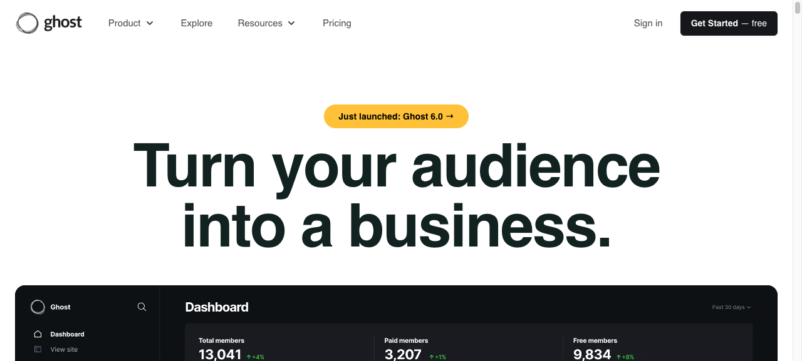

# 05 — Blog / Editorial

## What this gives you

A typography-forward editorial site for a writer, independent publication, or company blog. The layout is magazine-influenced: a large featured article hero with an image, a 2+1 article grid below, a sidebar-adjacent most-recent section, and a newsletter capture strip. Reading experience is paramount — constrained `prose` width, generous `leading-8`, a serif display font for article titles, and clear visual hierarchy between post types. Ghost.org and Mirror.xyz both nail this pattern; this recipe draws from both.

## Visual reference



Inspiration URLs (confirmed live 2026-04-23):
- https://ghost.org — featured post hero, 2-col grid, editorial typography, reading constraints
- https://resend.com/blog — dark blog layout, large post headlines, tag-based navigation
- https://vercel.com/blog — post cards with meta info, minimal header, clean grid

Verified Unsplash photos used:
- `photo-1557804506-669a67965ba0` — abstract data/light trails (1280×960)
- `photo-1499951360447-b19be8fe80f5` — laptop/developer workspace (1280×853)

## Design tokens

- **Palette:** `neutral-950` bg, `neutral-100` fg, `neutral-400` muted, `amber-400` accent/links, `neutral-900` card bg
- **Typography:** `font-serif` (Georgia or `ui-serif`) for article display titles; `font-sans` for nav/meta/body; `text-4xl sm:text-5xl font-bold` featured title; `leading-8` body prose; `max-w-[65ch]` reading width
- **Key ideas:**
  - Serif display titles signal "this is for reading" and differentiate the editorial register from tool/SaaS templates
  - The featured article occupies the full width; secondary articles get `aspect-video` thumbnail cards
  - Tag pills (`font-mono text-xs uppercase tracking-wider`) act as wayfinding across categories
  - Reading-width constraint (`max-w-[65ch]`) on article body text is non-negotiable for comfortable reading — wider than 75ch causes eye fatigue

## Sections (in order)

1. **Navbar** — publication name left, category nav center, subscribe CTA right
2. **Featured article** — large image, category tag, big serif title, excerpt, author + date + read time
3. **Article grid** — 2-col on desktop, cards with thumbnails
4. **Most recent** — no-thumbnail list of 5 latest posts, clean, scannable
5. **Newsletter strip** — centered email capture with publication tagline
6. **Footer** — minimal, links to categories + social

## Files the agent creates

- `app/preview/page.tsx` — full page
- `app/preview/layout.tsx` — title + metadata
- `app/preview/globals.css` — serif font, prose styles

## Code

### `app/preview/layout.tsx`

```tsx
import type { Metadata } from 'next';
import './globals.css';

export const metadata: Metadata = {
  title: 'The Long Dispatch',
  description: 'Slow takes on technology, work, and the culture around them.',
};

export default function PreviewLayout({ children }: { children: React.ReactNode }) {
  return (
    <html lang="en">
      <body className="bg-neutral-950 text-neutral-100 antialiased">{children}</body>
    </html>
  );
}
```

### `app/preview/globals.css`

```css
@import "tailwindcss";

@theme {
  --font-sans: ui-sans-serif, system-ui, -apple-system, sans-serif;
  --font-serif: Georgia, 'Times New Roman', ui-serif, serif;
  --font-mono: ui-monospace, 'Cascadia Code', monospace;
}

/* Article body prose styles */
.article-body p { line-height: 2; margin-bottom: 1.25rem; color: var(--color-neutral-300); }
.article-body h2 { font-size: 1.25rem; font-weight: 700; margin-top: 2.5rem; margin-bottom: 1rem; color: var(--color-neutral-50); }
.article-body a { color: var(--color-amber-400); text-underline-offset: 3px; }
.article-body blockquote {
  border-left: 2px solid var(--color-amber-500);
  padding-left: 1.25rem;
  color: var(--color-neutral-400);
  font-style: italic;
  margin: 1.5rem 0;
}
```

### `app/preview/page.tsx`

```tsx
const featuredPost = {
  category: 'Technology',
  title: 'The invisible infrastructure of trust that holds the internet together',
  excerpt: 'We take for granted that when we click a link, something trustworthy appears. Behind that click is a 40-year-old chain of delegation, compromise, and institutional faith that almost nobody thinks about until it breaks.',
  author: 'Noa Ashworth',
  authorInitials: 'NA',
  date: 'April 18, 2026',
  readTime: '14 min read',
  imageId: 'photo-1557804506-669a67965ba0',
  href: '#',
};

const gridPosts = [
  {
    category: 'Work',
    title: 'What the four-day week actually changed (and what it didn\'t)',
    excerpt: 'Six months into our experiment, the real data is in — and it\'s more nuanced than either the enthusiasts or the skeptics predicted.',
    author: 'Priya Rajan',
    authorInitials: 'PR',
    date: 'April 14, 2026',
    readTime: '9 min read',
    imageId: 'photo-1499951360447-b19be8fe80f5',
    href: '#',
  },
  {
    category: 'Society',
    title: 'The geography of remote work, three years on',
    excerpt: 'Remote work didn\'t just move where people lived — it restructured what cities are for. We looked at five mid-size cities that won the redistribution.',
    author: 'Daniel Yuen',
    authorInitials: 'DY',
    date: 'April 10, 2026',
    readTime: '11 min read',
    imageId: 'photo-1618005182384-a83a8bd57fbe',
    href: '#',
  },
];

const recentPosts = [
  { number: '061', title: 'The return of the generalist engineer', date: 'Apr 7', category: 'Technology', href: '#' },
  { number: '060', title: 'On building in public when the public isn\'t kind', date: 'Mar 31', category: 'Work', href: '#' },
  { number: '059', title: 'What Silicon Valley got wrong about cities', date: 'Mar 24', category: 'Society', href: '#' },
  { number: '058', title: 'The product manager identity crisis', date: 'Mar 17', category: 'Work', href: '#' },
  { number: '057', title: 'Reading the room: attention and software design', date: 'Mar 10', category: 'Design', href: '#' },
];

const categories = ['Technology', 'Work', 'Society', 'Design', 'Culture'];

export default function EditorialBlog() {
  return (
    <div className="min-h-screen bg-neutral-950 text-neutral-100">
      {/* Navbar */}
      <header className="sticky top-0 z-50 border-b border-neutral-800/60 backdrop-blur-md bg-neutral-950/85">
        <nav className="max-w-7xl mx-auto px-6 h-14 flex items-center gap-6">
          <a
            href="#"
            className="font-bold text-neutral-100 mr-4 whitespace-nowrap"
            style={{ fontFamily: 'Georgia, ui-serif, serif' }}
          >
            The Long Dispatch
          </a>
          <ul className="hidden md:flex items-center gap-5 flex-1 overflow-x-auto">
            {categories.map((cat) => (
              <li key={cat}>
                <a href="#" className="text-xs font-mono text-neutral-500 hover:text-neutral-200 uppercase tracking-widest whitespace-nowrap transition-colors">
                  {cat}
                </a>
              </li>
            ))}
          </ul>
          <a
            href="#subscribe"
            className="ml-auto flex-shrink-0 bg-amber-400 hover:bg-amber-300 text-neutral-950 text-xs font-semibold px-3 py-1.5 rounded-lg transition-colors"
          >
            Subscribe
          </a>
        </nav>
      </header>

      <main className="max-w-7xl mx-auto px-6 py-10">
        {/* Featured post */}
        <article className="mb-12 grid grid-cols-1 lg:grid-cols-2 gap-8 items-start">
          <a href={featuredPost.href} className="group block overflow-hidden rounded-2xl bg-neutral-900 aspect-video">
            
          </a>
          <div className="flex flex-col justify-center gap-4">
            <span className="text-xs font-mono text-amber-400 uppercase tracking-widest">
              {featuredPost.category}
            </span>
            <a href={featuredPost.href} className="group">
              <h1
                className="text-3xl sm:text-4xl font-bold leading-snug text-neutral-50 group-hover:text-amber-400 transition-colors"
                style={{ fontFamily: 'Georgia, ui-serif, serif' }}
              >
                {featuredPost.title}
              </h1>
            </a>
            <p className="text-neutral-400 text-base leading-7">
              {featuredPost.excerpt}
            </p>
            <div className="flex items-center gap-3 pt-1">
              <div className="w-7 h-7 rounded-full bg-amber-500/20 border border-amber-500/30 flex items-center justify-center text-[10px] text-amber-400 font-bold">
                {featuredPost.authorInitials}
              </div>
              <div className="text-xs text-neutral-500">
                <span className="text-neutral-300">{featuredPost.author}</span>
                <span className="mx-1.5">·</span>
                {featuredPost.date}
                <span className="mx-1.5">·</span>
                {featuredPost.readTime}
              </div>
            </div>
          </div>
        </article>

        <div className="grid grid-cols-1 lg:grid-cols-[1fr_300px] gap-8">
          {/* Article grid */}
          <div>
            <h2 className="text-xs font-mono text-neutral-600 uppercase tracking-widest mb-5">Latest</h2>
            <div className="grid grid-cols-1 sm:grid-cols-2 gap-5 mb-10">
              {gridPosts.map(({ category, title, excerpt, author, authorInitials, date, readTime, imageId, href }) => (
                <article key={title} className="group flex flex-col">
                  <a href={href} className="block overflow-hidden rounded-xl bg-neutral-900 aspect-video mb-4">
                    
                  </a>
                  <span className="text-[10px] font-mono text-amber-400 uppercase tracking-widest mb-2">{category}</span>
                  <a href={href}>
                    <h2
                      className="text-xl font-bold leading-snug text-neutral-100 group-hover:text-amber-400 transition-colors mb-2"
                      style={{ fontFamily: 'Georgia, ui-serif, serif' }}
                    >
                      {title}
                    </h2>
                  </a>
                  <p className="text-sm text-neutral-500 leading-relaxed flex-1 mb-3">{excerpt}</p>
                  <div className="flex items-center gap-2">
                    <div className="w-6 h-6 rounded-full bg-neutral-700 flex items-center justify-center text-[9px] text-neutral-300 font-bold">
                      {authorInitials}
                    </div>
                    <span className="text-xs text-neutral-600">
                      {author} · {date} · {readTime}
                    </span>
                  </div>
                </article>
              ))}
            </div>
          </div>

          {/* Sidebar — most recent */}
          <aside>
            <h2 className="text-xs font-mono text-neutral-600 uppercase tracking-widest mb-5">Archive</h2>
            <ul className="space-y-0.5">
              {recentPosts.map(({ number, title, date, category, href }) => (
                <li key={number}>
                  <a
                    href={href}
                    className="group flex items-start gap-3 py-3 border-b border-neutral-800/60 last:border-0 hover:bg-neutral-900/50 -mx-3 px-3 rounded transition-colors"
                  >
                    <span className="text-[10px] font-mono text-neutral-700 mt-0.5 flex-shrink-0 w-8">{number}</span>
                    <div className="flex-1 min-w-0">
                      <p className="text-sm text-neutral-400 group-hover:text-neutral-200 transition-colors leading-snug mb-0.5">{title}</p>
                      <p className="text-[10px] font-mono text-neutral-700">{category} · {date}</p>
                    </div>
                  </a>
                </li>
              ))}
            </ul>
          </aside>
        </div>

        {/* Newsletter strip */}
        <section id="subscribe" className="border-t border-neutral-800/60 py-16 text-center">
          <h2
            className="text-2xl sm:text-3xl font-bold text-neutral-50 mb-3"
            style={{ fontFamily: 'Georgia, ui-serif, serif' }}
          >
            Slow takes, delivered weekly
          </h2>
          <p className="text-neutral-500 text-sm mb-6 max-w-sm mx-auto">
            No breaking news. No hot takes. Just deeply reported essays on what technology
            is doing to work and culture. Free, always.
          </p>
          <form
            className="flex flex-col sm:flex-row gap-3 max-w-sm mx-auto"
            onSubmit={(e) => e.preventDefault()}
          >
            <label htmlFor="blog-subscribe" className="sr-only">Email address</label>
            <input
              id="blog-subscribe"
              type="email"
              placeholder="your@email.com"
              className="flex-1 bg-neutral-900 border border-neutral-800 rounded-xl px-4 py-2.5 text-sm text-neutral-100 placeholder:text-neutral-600 focus:outline-none focus:border-amber-500"
            />
            <button
              type="submit"
              className="bg-amber-400 hover:bg-amber-300 text-neutral-950 font-semibold text-sm px-5 py-2.5 rounded-xl transition-colors whitespace-nowrap"
            >
              Subscribe free
            </button>
          </form>
          <p className="text-xs text-neutral-700 mt-3">2,800 readers. No spam. Unsubscribe any time.</p>
        </section>
      </main>

      {/* Footer */}
      <footer className="border-t border-neutral-800/60 py-8 px-6">
        <div className="max-w-7xl mx-auto flex flex-col sm:flex-row items-center justify-between gap-4">
          <span
            className="text-sm font-bold text-neutral-500"
            style={{ fontFamily: 'Georgia, ui-serif, serif' }}
          >
            The Long Dispatch
          </span>
          <div className="flex items-center gap-5 text-xs font-mono text-neutral-700">
            {categories.map((cat) => (
              <a key={cat} href="#" className="hover:text-neutral-400 transition-colors">{cat}</a>
            ))}
          </div>
          <p className="text-xs text-neutral-700">© 2026</p>
        </div>
      </footer>
    </div>
  );
}
```

## Integration hook — how the embedded agent invokes this

When the user asks for "a blog", "editorial site", "writing site", "publication layout", or "magazine-style page", follow `docs/templates/05-blog-editorial.md`: replace `app/preview/page.tsx` with the provided code; replace "The Long Dispatch" with the publication name; update `featuredPost`, `gridPosts`, and `recentPosts` with real or placeholder content matching the user's topics; update categories to match the user's content taxonomy.

## Variations

- **Single-column layout:** Remove the sidebar and go full-width for a more newsletter-like reading experience. Stack the article grid to a single column with wider cards — works better for publications with longer titles.
- **Dark-to-light hero:** Make the featured post image a full-bleed section (like a magazine cover) with white overlay text — `relative h-[60vh] overflow-hidden` with a dark gradient overlay and white type.
- **Tagged taxonomy page:** Replace the featured article and grid with a flat chronological list filtered by tag — useful for the individual category pages that link from the nav.

## Common pitfalls

- The inline `style={{ fontFamily: 'Georgia, ...' }}` on headings overrides Tailwind's `font-serif` utility — if you later configure `--font-serif` in `@theme`, switch to `className="font-serif"` and remove the inline styles to avoid the specificity conflict.
- `aspect-video` on image cards assumes the image crop is landscape (16:9) — if the user's images are portrait or square, use `aspect-[4/3]` or `aspect-square` instead.
- The featured article uses a `grid-cols-2` split on `lg:` screens — on tablets (`md:`) it stacks to a single column. This means the image appears above the text on mobile, which is correct, but verify the image has good small-format cropping.
- `leading-8` in article body prose is `2rem` — beautiful at `text-base` (16px) but too loose at `text-sm` (14px) or larger `text-lg`. Match line-height to base font size.
- Serif display fonts (`Georgia`) may not load on some enterprise Windows environments that strip system fonts. Always include the full fallback chain: `'Georgia', 'Times New Roman', ui-serif, serif`.
