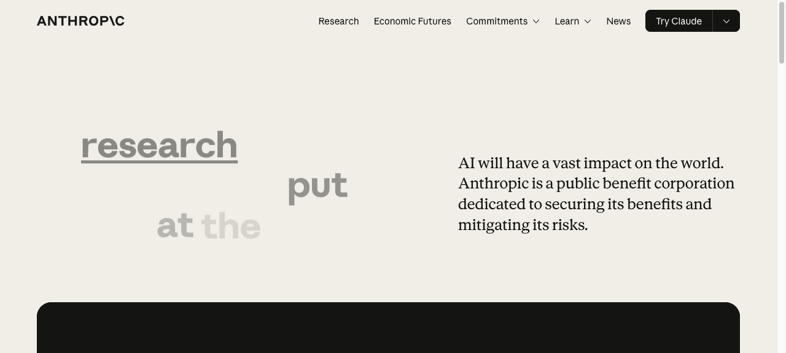
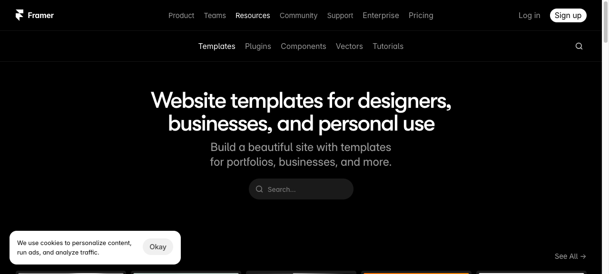

# 08 — Agency / Consulting

## What this gives you

A consulting, design studio, or creative agency landing page. Bold statement hero with a single-sentence manifesto at large type, a services grid with hover interactions, a case studies section with oversized client outcomes, a team section, and a client logo wall. The aesthetic is confident and minimal — the copy does the heavy lifting. Inspired by top-tier design studios that let whitespace and typography signal quality rather than visual complexity.

## Visual reference




Inspiration URLs (confirmed live 2026-04-23):
- https://www.anthropic.com — manifesto-style hero, whitespace as quality signal, understated palette
- https://framer.com/marketplace/templates — agency template patterns, case study card formats
- https://linear.app — service cards with icon+description, outcome-first copy

## Design tokens

- **Palette:** `neutral-950` bg, `neutral-100` fg, `neutral-500` muted, `rose-500` accent, `neutral-900` card bg, `neutral-800` border
- **Typography:** `text-5xl sm:text-7xl lg:text-8xl font-black tracking-tighter` hero manifesto; `text-sm font-mono uppercase tracking-widest` section labels; `text-3xl font-bold tracking-tight` case study outcome numbers
- **Key ideas:**
  - Opening line is a provocation, not a description — "We make software that earns its place." vs "We are a software agency."
  - Services listed with a number prefix (`01 /`, `02 /`) adds editorial structure
  - Case studies lead with a metric (`+340% activation`, `€2.4M recovered`) — outcome before context
  - Team section: small, human — 3–4 people max for a boutique agency feel
  - Client logos in a tight grid, not a scrolling marquee — implies selective, curated partnerships

## Sections (in order)

1. **Navbar** — studio name left, minimal links right, no CTA button (the whole page is the CTA)
2. **Hero** — full-width manifesto statement, secondary tagline, scroll CTA
3. **Services** — numbered list of 4 core services, icon + title + 2-line description
4. **Case studies** — 3 cards with client name, outcome metric, one-line description, tag
5. **Client logos** — "Selected clients" label + 6 logo placeholders
6. **Team** — 3-person grid with name, title, one-line bio
7. **CTA band** — "Start a project" heading, contact button
8. **Footer** — studio name, tagline, social, legal

## Files the agent creates

- `app/preview/page.tsx` — full page
- `app/preview/layout.tsx` — title + metadata
- `app/preview/globals.css` — base styles

## Code

### `app/preview/layout.tsx`

```tsx
import type { Metadata } from 'next';
import './globals.css';

export const metadata: Metadata = {
  title: 'Clave Studio — Product Design & Engineering',
  description: 'We make software that earns its place. Product design and engineering for ambitious companies.',
};

export default function PreviewLayout({ children }: { children: React.ReactNode }) {
  return (
    <html lang="en">
      <body className="bg-neutral-950 text-neutral-100 antialiased">{children}</body>
    </html>
  );
}
```

### `app/preview/globals.css`

```css
@import "tailwindcss";

@theme {
  --font-sans: ui-sans-serif, system-ui, -apple-system, sans-serif;
  --font-mono: ui-monospace, 'Cascadia Code', monospace;
}
```

### `app/preview/page.tsx`

```tsx
const services = [
  { number: '01', title: 'Product strategy', desc: 'We help founders and product leaders decide what to build next — and what to cut. Workshops, audits, and structured frameworks.' },
  { number: '02', title: 'Interface design', desc: 'Figma-first, code-aware design. Systems thinking from the first frame — not a collection of one-off screens.' },
  { number: '03', title: 'Frontend engineering', desc: 'React, Next.js, and the modern web stack. We build the production code, not just the prototype.' },
  { number: '04', title: 'Design systems', desc: 'Reusable component libraries that close the gap between design and engineering. Token-based, documented, maintained.' },
];

const caseStudies = [
  {
    client: 'Axiom',
    outcome: '+340%',
    metric: 'user activation',
    desc: 'Redesigned onboarding from six steps to one. New users reached their first query in under two minutes.',
    tag: 'Product design',
    year: '2025',
  },
  {
    client: 'Harbor Labs',
    outcome: '€2.4M',
    metric: 'recovered ARR',
    desc: 'Rebuilt the billing and upgrade flow. Identified three drop-off points and removed them.',
    tag: 'UX + Engineering',
    year: '2025',
  },
  {
    client: 'Meridian Health',
    outcome: '8× faster',
    metric: 'clinical charting',
    desc: 'Created a keyboard-first charting interface for clinicians. Reduced average note time from 4 minutes to 30 seconds.',
    tag: 'Systems design',
    year: '2024',
  },
];

const clients = ['Axiom', 'Harbor Labs', 'Meridian', 'Lineage', 'Crestline', 'Vault AI'];

const team = [
  {
    name: 'Soren Kade',
    title: 'Founding Partner, Design',
    initials: 'SK',
    bio: 'Former design lead at Figma and Linear. 12 years building products people pay for.',
  },
  {
    name: 'Yuki Tanaka',
    title: 'Founding Partner, Engineering',
    initials: 'YT',
    bio: 'Former staff engineer at Vercel. Obsessed with performance, accessibility, and test coverage.',
  },
  {
    name: 'Priya Mehta',
    title: 'Partner, Strategy',
    initials: 'PM',
    bio: 'Former VP Product at two unicorns. Helps founders see the decision they\'re actually making.',
  },
];

export default function AgencyPage() {
  return (
    <div className="min-h-screen bg-neutral-950 text-neutral-100">
      {/* Navbar */}
      <header className="sticky top-0 z-50 border-b border-neutral-800/40 backdrop-blur-md bg-neutral-950/80">
        <nav className="max-w-7xl mx-auto px-6 h-16 flex items-center justify-between">
          <a href="#" className="font-black tracking-tight text-neutral-100 text-lg">
            Clave<span className="text-rose-500">.</span>
          </a>
          <ul className="hidden md:flex items-center gap-8 text-sm text-neutral-500">
            <li><a href="#work" className="hover:text-neutral-200 transition-colors">Work</a></li>
            <li><a href="#services" className="hover:text-neutral-200 transition-colors">Services</a></li>
            <li><a href="#team" className="hover:text-neutral-200 transition-colors">Team</a></li>
          </ul>
          <a
            href="#contact"
            className="text-sm text-neutral-400 hover:text-neutral-100 border border-neutral-700 hover:border-neutral-500 px-4 py-2 rounded-xl transition-colors"
          >
            Start a project
          </a>
        </nav>
      </header>

      {/* Hero */}
      <section className="max-w-7xl mx-auto px-6 pt-20 pb-24">
        <p className="text-xs font-mono text-rose-500 uppercase tracking-widest mb-8">
          Product Design &amp; Engineering Studio
        </p>
        <h1 className="text-5xl sm:text-6xl lg:text-8xl font-black tracking-tighter text-neutral-50 leading-[0.95] mb-10 max-w-5xl">
          We make software that earns its place.
        </h1>
        <div className="flex flex-col sm:flex-row items-start sm:items-end justify-between gap-6">
          <p className="text-lg sm:text-xl text-neutral-400 max-w-lg leading-relaxed">
            Clave is a small studio working with ambitious teams on the parts of their product
            that matter most — the interface, the onboarding, the moment of first value.
          </p>
          <a
            href="#work"
            className="flex items-center gap-2 text-sm text-neutral-500 hover:text-neutral-200 transition-colors whitespace-nowrap"
          >
            See the work
            <svg className="w-4 h-4 animate-bounce" viewBox="0 0 16 16" fill="none" aria-hidden="true">
              <path d="M8 3v10M4 9l4 4 4-4" stroke="currentColor" strokeWidth="1.5" strokeLinecap="round" strokeLinejoin="round"/>
            </svg>
          </a>
        </div>
      </section>

      {/* Services */}
      <section id="services" className="border-t border-neutral-800/60 py-20 px-6">
        <div className="max-w-7xl mx-auto">
          <p className="text-xs font-mono text-neutral-600 uppercase tracking-widest mb-10">What we do</p>
          <div className="grid grid-cols-1 md:grid-cols-2 gap-px bg-neutral-800/40 rounded-2xl overflow-hidden">
            {services.map(({ number, title, desc }) => (
              <div
                key={number}
                className="bg-neutral-950 p-8 hover:bg-neutral-900/70 transition-colors group"
              >
                <div className="flex items-start gap-6">
                  <span className="text-xs font-mono text-neutral-700 mt-1 flex-shrink-0 group-hover:text-rose-500 transition-colors">
                    {number} /
                  </span>
                  <div>
                    <h3 className="text-lg font-semibold text-neutral-100 mb-2 tracking-tight">{title}</h3>
                    <p className="text-sm text-neutral-500 leading-relaxed">{desc}</p>
                  </div>
                </div>
              </div>
            ))}
          </div>
        </div>
      </section>

      {/* Case studies */}
      <section id="work" className="border-t border-neutral-800/60 py-20 px-6">
        <div className="max-w-7xl mx-auto">
          <p className="text-xs font-mono text-neutral-600 uppercase tracking-widest mb-10">Selected work</p>
          <div className="grid grid-cols-1 md:grid-cols-3 gap-5">
            {caseStudies.map(({ client, outcome, metric, desc, tag, year }) => (
              <div
                key={client}
                className="group bg-neutral-900 border border-neutral-800 rounded-2xl p-6 hover:border-neutral-700 transition-colors cursor-pointer"
              >
                <div className="flex items-start justify-between mb-6">
                  <span className="text-xs font-mono text-neutral-600 uppercase tracking-widest">{client}</span>
                  <span className="text-xs font-mono text-neutral-700">{year}</span>
                </div>
                <div className="mb-4">
                  <div className="text-4xl font-black tracking-tighter text-rose-400 leading-none">{outcome}</div>
                  <div className="text-sm text-neutral-500 mt-1">{metric}</div>
                </div>
                <p className="text-sm text-neutral-400 leading-relaxed mb-5">{desc}</p>
                <span className="text-[10px] font-mono bg-neutral-800 text-neutral-500 px-2 py-1 rounded-full">{tag}</span>
              </div>
            ))}
          </div>
        </div>
      </section>

      {/* Client logos */}
      <section className="border-t border-neutral-800/60 py-14 px-6">
        <div className="max-w-7xl mx-auto">
          <p className="text-xs font-mono text-neutral-700 uppercase tracking-widest mb-8 text-center">Selected clients</p>
          <div className="flex flex-wrap items-center justify-center gap-x-12 gap-y-5">
            {clients.map((name) => (
              <span key={name} className="text-neutral-700 hover:text-neutral-500 transition-colors font-semibold text-sm tracking-wide cursor-default">
                {name}
              </span>
            ))}
          </div>
        </div>
      </section>

      {/* Team */}
      <section id="team" className="border-t border-neutral-800/60 py-20 px-6">
        <div className="max-w-7xl mx-auto">
          <p className="text-xs font-mono text-neutral-600 uppercase tracking-widest mb-10">The team</p>
          <div className="grid grid-cols-1 md:grid-cols-3 gap-6">
            {team.map(({ name, title, initials, bio }) => (
              <div key={name} className="flex gap-4">
                <div className="w-10 h-10 rounded-xl bg-rose-500/10 border border-rose-500/20 flex items-center justify-center text-xs font-bold text-rose-400 flex-shrink-0">
                  {initials}
                </div>
                <div>
                  <div className="font-semibold text-neutral-100 text-sm mb-0.5">{name}</div>
                  <div className="text-xs text-neutral-600 mb-2">{title}</div>
                  <p className="text-sm text-neutral-500 leading-relaxed">{bio}</p>
                </div>
              </div>
            ))}
          </div>
        </div>
      </section>

      {/* CTA band */}
      <section id="contact" className="border-t border-neutral-800/60 py-20 px-6">
        <div className="max-w-3xl mx-auto text-center">
          <h2 className="text-4xl sm:text-5xl font-black tracking-tighter text-neutral-50 mb-5 leading-[1.0]">
            Have a project in mind?
          </h2>
          <p className="text-neutral-400 text-lg mb-8 leading-relaxed">
            We take on four new clients per quarter. We respond to every inquiry within 24 hours.
          </p>
          <a
            href="mailto:hello@clave.studio"
            className="inline-flex items-center gap-2 bg-rose-600 hover:bg-rose-500 text-white font-semibold px-8 py-4 rounded-xl text-base transition-colors shadow-lg shadow-rose-900/40"
          >
            Start a conversation
            <svg className="w-5 h-5" viewBox="0 0 20 20" fill="none" aria-hidden="true">
              <path d="M4 10h12M12 5l5 5-5 5" stroke="currentColor" strokeWidth="1.5" strokeLinecap="round" strokeLinejoin="round"/>
            </svg>
          </a>
          <p className="text-xs text-neutral-700 mt-4 font-mono">hello@clave.studio</p>
        </div>
      </section>

      {/* Footer */}
      <footer className="border-t border-neutral-800/60 py-8 px-6">
        <div className="max-w-7xl mx-auto flex flex-col sm:flex-row items-center justify-between gap-4">
          <a href="#" className="font-black tracking-tight text-neutral-600 text-sm">
            Clave<span className="text-rose-500">.</span>
          </a>
          <p className="text-xs text-neutral-700">Product design and engineering. Remote-first.</p>
          <div className="flex items-center gap-5 text-xs text-neutral-700">
            <a href="https://twitter.com" className="hover:text-neutral-500 transition-colors">Twitter</a>
            <a href="https://linkedin.com" className="hover:text-neutral-500 transition-colors">LinkedIn</a>
            <span>© 2026 Clave Studio</span>
          </div>
        </div>
      </footer>
    </div>
  );
}
```

## Integration hook — how the embedded agent invokes this

When the user asks for "an agency site", "consulting website", "studio portfolio", "creative agency landing", or "design studio page", follow `docs/templates/08-agency.md`: replace `app/preview/page.tsx` with the provided code; replace "Clave" with the studio name; update `services` with the agency's actual service offering; update `caseStudies` and `team` with real or placeholder data; swap `rose-500` accent for the studio's brand color.

## Variations

- **Full-case-study page:** Make the case study cards link to expanded pages (`/case/axiom`) — each gets a hero quote, the full before/after, and a metrics section. The card is just the hook.
- **Single-discipline focus:** Remove the services grid and make the hero 100% of the first screen — just the manifesto and a "See work ↓" link. Works better for studios that don't want to categorize themselves too early.
- **Light mode:** The rose accent reads better on white/light backgrounds than on dark — swap to `rose-600` (darker shade) for sufficient contrast on `neutral-50` backgrounds.

## Common pitfalls

- The services grid uses `grid-cols-2 gap-px bg-neutral-800/40` with children having `bg-neutral-950` — the `gap-px` + background trick creates hair-thin dividing lines between cells without borders. If you add `rounded-2xl` to individual cells, the effect breaks — keep `rounded-2xl` only on the wrapper.
- The `font-black tracking-tighter` hero at `text-8xl` can cause text to break at unusual points on `sm:` screens. Always test the hero sentence on 375px — add `hyphens-auto lang="en"` if needed.
- The case study outcome numbers use `text-4xl font-black` — if the client provides a shorter metric like "2×", it won't fill the space as well as "€2.4M". Use `text-5xl` or `text-6xl` for single-character metrics.
- `mailto:hello@clave.studio` in the CTA band opens the OS mail client — this is intentional for a studio that wants direct contact over a contact form. Swap for a Typeform/Tally link if a form is preferred.
- The sticky header uses `backdrop-blur-md bg-neutral-950/80` — at 80% opacity, very saturated colors in the hero can show through and tint the nav. Use `bg-neutral-950/90` if the hero image has vibrant colors.
