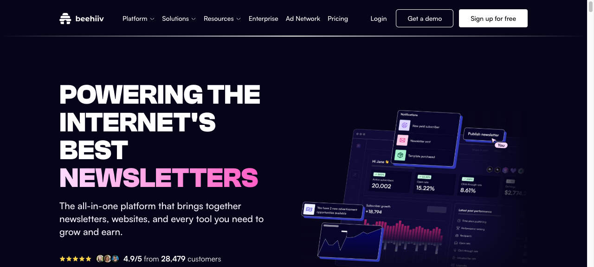

# 11 — Newsletter & Creator Personal Brand

## What this gives you

A minimal, typography-forward single-page site for an independent writer, newsletter, or content creator. The hero is centered and large — name, tagline, and an email capture form are the entire first screen. Below: a "recent issues" grid with post cards, a brief "about" section, social proof subscriber count, and a sparse footer with social links. The vibe is Substack-meets-Ramp-meets-personal-website: confident whitespace, a serif display headline, a light/cream-on-dark or cream-on-cream color story. Ghost.org and Beehiiv both nail this aesthetic.

## Visual reference




Inspiration URLs (confirmed live 2026-04-23):
- https://ghost.org — minimal chrome, large email capture, recent posts pattern
- https://www.beehiiv.com — subscriber metrics social proof, bold numbers, dark palette option
- https://resend.com — "built by humans" copy tone, minimal nav

## Design tokens

- **Palette:** `neutral-950` bg, `neutral-100` primary fg, `neutral-500` muted, `amber-400` accent (warm, editorial), `neutral-900` card bg, `neutral-800` card border
- **Typography:** `text-6xl sm:text-7xl font-bold tracking-tight` display name (suggest Georgia or `font-serif` stack); `text-base sm:text-lg text-neutral-400 leading-relaxed` subtitle; `font-mono text-xs` for post numbers/dates
- **Key ideas:**
  - Serif display name creates a "personal brand" feel instantly — one line of `font-serif` changes the whole register
  - Hero email capture is the primary CTA — large input + button, centered, no sidebar noise
  - Subscriber count ("Join 14,200 readers") acts as social proof directly below the CTA
  - Post cards use a large issue number as a background watermark — creates visual hierarchy without images
  - Generous vertical spacing between sections (`py-24`) — "editorial breathing room"

## Sections (in order)

1. **Minimal nav** — just logo/name left, optional "Archive" and "About" links right, no hamburger needed
2. **Hero** — large serif name, one-line tagline, email capture form, subscriber count
3. **Recent issues** — 3-column grid of post cards (issue # watermark, title, date, 1-line excerpt)
4. **About strip** — left-aligned short bio, optional inline photo placeholder, links
5. **Footer** — social links (Twitter/X, Substack, RSS), legal line

## Files the agent creates

- `app/preview/page.tsx` — full page
- `app/preview/layout.tsx` — title + metadata
- `app/preview/globals.css` — base styles with serif font stack

## Code

### `app/preview/layout.tsx`

```tsx
import type { Metadata } from 'next';
import './globals.css';

export const metadata: Metadata = {
  title: 'Meridian — A newsletter on the future of work',
  description: 'Weekly essays on technology, organizations, and what comes next. Join 14,200 readers.',
};

export default function PreviewLayout({ children }: { children: React.ReactNode }) {
  return (
    <html lang="en">
      <body className="bg-neutral-950 text-neutral-100 antialiased">{children}</body>
    </html>
  );
}
```

### `app/preview/globals.css`

```css
@import "tailwindcss";

@theme {
  --font-sans: ui-sans-serif, system-ui, -apple-system, sans-serif;
  --font-serif: Georgia, 'Times New Roman', ui-serif, serif;
  --font-mono: ui-monospace, 'Cascadia Code', monospace;
}
```

### `app/preview/page.tsx`

```tsx
const posts = [
  {
    issue: 41,
    title: 'The meeting that never should have happened',
    date: 'Apr 14, 2026',
    excerpt: 'On synchronous culture as a tax on deep work, and why the best teams are moving toward async-first operating models.',
    tag: 'Organizations',
  },
  {
    issue: 40,
    title: 'Why your roadmap is a fiction',
    date: 'Apr 7, 2026',
    excerpt: 'Product roadmaps comfort executives and mislead engineers. Here\'s what to do instead when the future is genuinely uncertain.',
    tag: 'Strategy',
  },
  {
    issue: 39,
    title: 'The infrastructure layer of trust',
    date: 'Mar 31, 2026',
    excerpt: 'Identity, credentialing, and the quiet revolution in who gets to vouch for whom in professional networks.',
    tag: 'Tech & Society',
  },
  {
    issue: 38,
    title: 'Abundance thinking vs. scarcity theater',
    date: 'Mar 24, 2026',
    excerpt: 'Why some founders build like resources are infinite and still ship discipline, while others ship panic. A pattern analysis.',
    tag: 'Startups',
  },
  {
    issue: 37,
    title: 'The principal-agent problem in software',
    date: 'Mar 17, 2026',
    excerpt: 'Code is written by individuals whose incentives rarely align with the organizations that deploy it. What does good alignment look like?',
    tag: 'Engineering',
  },
  {
    issue: 36,
    title: 'Sleep and the myth of the 10x engineer',
    date: 'Mar 10, 2026',
    excerpt: 'Two decades of performance data says sustained sleep debt is the most reliable predictor of engineering errors. The data is damning.',
    tag: 'People',
  },
];

export default function NewsletterPage() {
  return (
    <div className="min-h-screen bg-neutral-950 text-neutral-100">
      {/* Nav */}
      <header className="max-w-3xl mx-auto px-6 py-6 flex items-center justify-between">
        <a
          href="#"
          className="font-bold text-neutral-100 tracking-tight"
          style={{ fontFamily: 'Georgia, ui-serif, serif' }}
        >
          Meridian
        </a>
        <nav className="flex items-center gap-6 text-sm text-neutral-500">
          <a href="#archive" className="hover:text-neutral-200 transition-colors">Archive</a>
          <a href="#about" className="hover:text-neutral-200 transition-colors">About</a>
          <a
            href="#subscribe"
            className="bg-amber-400 hover:bg-amber-300 text-neutral-950 font-medium text-xs px-3 py-1.5 rounded-lg transition-colors"
          >
            Subscribe
          </a>
        </nav>
      </header>

      {/* Hero */}
      <section id="subscribe" className="max-w-3xl mx-auto px-6 pt-16 pb-20 text-center">
        {/* Eyebrow */}
        <p className="text-xs font-mono text-neutral-600 uppercase tracking-widest mb-6">
          Weekly · Since 2022
        </p>
        {/* Display name */}
        <h1
          className="text-6xl sm:text-7xl lg:text-8xl font-bold tracking-tight text-neutral-50 mb-6 leading-[0.95]"
          style={{ fontFamily: 'Georgia, ui-serif, serif' }}
        >
          Meridian
        </h1>
        {/* Tagline */}
        <p className="text-lg sm:text-xl text-neutral-400 max-w-xl mx-auto mb-10 leading-relaxed">
          Essays on technology, work, and the future of organizations.
          Clear thinking for people who have to make hard calls.
        </p>

        {/* Email capture */}
        <form
          className="flex flex-col sm:flex-row gap-3 max-w-md mx-auto mb-5"
          onSubmit={(e) => e.preventDefault()}
        >
          <label htmlFor="email-capture" className="sr-only">Email address</label>
          <input
            id="email-capture"
            type="email"
            placeholder="your@email.com"
            required
            className="flex-1 bg-neutral-900 border border-neutral-800 rounded-xl px-4 py-3 text-sm text-neutral-100 placeholder:text-neutral-600 focus:outline-none focus:border-neutral-600 focus:ring-1 focus:ring-neutral-600"
          />
          <button
            type="submit"
            className="bg-amber-400 hover:bg-amber-300 text-neutral-950 font-semibold text-sm px-6 py-3 rounded-xl transition-colors whitespace-nowrap"
          >
            Subscribe free
          </button>
        </form>

        {/* Social proof */}
        <div className="flex items-center justify-center gap-1.5 text-sm text-neutral-600">
          <div className="flex -space-x-2">
            {['MR', 'YT', 'CR', 'PK'].map((initials) => (
              <div
                key={initials}
                className="w-6 h-6 rounded-full bg-neutral-700 border-2 border-neutral-950 flex items-center justify-center text-[8px] text-neutral-400 font-medium"
              >
                {initials}
              </div>
            ))}
          </div>
          <span>Join <strong className="text-neutral-400">14,200</strong> readers. Free, always.</span>
        </div>
      </section>

      {/* Divider */}
      <div className="max-w-3xl mx-auto px-6">
        <hr className="border-neutral-800" />
      </div>

      {/* Recent issues */}
      <section id="archive" className="max-w-5xl mx-auto px-6 py-16">
        <div className="flex items-center justify-between mb-8 max-w-3xl mx-auto xl:max-w-none">
          <h2 className="text-sm font-mono text-neutral-600 uppercase tracking-widest">Recent issues</h2>
          <a href="#" className="text-xs text-neutral-600 hover:text-neutral-400 transition-colors">
            View all 41 issues →
          </a>
        </div>
        <div className="grid grid-cols-1 md:grid-cols-2 lg:grid-cols-3 gap-5">
          {posts.map(({ issue, title, date, excerpt, tag }) => (
            <a
              key={issue}
              href="#"
              className="group relative bg-neutral-900 border border-neutral-800 rounded-2xl p-6 hover:border-neutral-700 transition-colors overflow-hidden flex flex-col gap-3"
            >
              {/* Large issue number watermark */}
              <span
                className="absolute right-4 top-2 text-[72px] font-bold text-neutral-800/50 leading-none select-none pointer-events-none"
                aria-hidden="true"
              >
                {issue}
              </span>

              {/* Tag */}
              <span className="relative inline-flex self-start text-[10px] font-mono text-neutral-600 bg-neutral-800 px-2 py-0.5 rounded-full uppercase tracking-widest">
                {tag}
              </span>

              {/* Title */}
              <h3 className="relative text-base font-semibold text-neutral-100 group-hover:text-amber-400 transition-colors leading-snug">
                {title}
              </h3>

              {/* Excerpt */}
              <p className="relative text-sm text-neutral-500 leading-relaxed line-clamp-3 flex-1">
                {excerpt}
              </p>

              {/* Date */}
              <p className="relative text-xs font-mono text-neutral-700 mt-auto">{date}</p>
            </a>
          ))}
        </div>
      </section>

      {/* About strip */}
      <section id="about" className="border-t border-neutral-800/60 py-16 px-6">
        <div className="max-w-3xl mx-auto flex flex-col sm:flex-row items-start gap-8">
          {/* Avatar placeholder */}
          <div className="w-16 h-16 sm:w-20 sm:h-20 rounded-full bg-gradient-to-br from-amber-400/20 to-amber-600/20 border border-amber-500/20 flex-shrink-0 flex items-center justify-center text-amber-400 text-2xl font-bold" style={{ fontFamily: 'Georgia, ui-serif, serif' }}>
            A
          </div>
          <div>
            <h2 className="text-lg font-semibold text-neutral-100 mb-2">About the author</h2>
            <p className="text-neutral-400 text-sm leading-relaxed mb-4">
              Anya Reyes has spent fifteen years at the intersection of engineering and strategy —
              building products at two public companies, advising a dozen startups, and writing about
              what actually works. Meridian is where she thinks out loud.
            </p>
            <div className="flex items-center gap-4 text-xs text-neutral-600">
              <a href="https://twitter.com" className="hover:text-neutral-400 transition-colors flex items-center gap-1">
                <svg className="w-3.5 h-3.5" viewBox="0 0 24 24" fill="currentColor" aria-hidden="true">
                  <path d="M18.244 2.25h3.308l-7.227 8.26 8.502 11.24H16.17l-4.714-6.231-5.401 6.231H2.744l7.73-8.835L1.254 2.25H8.08l4.713 6.231zm-1.161 17.52h1.833L7.084 4.126H5.117z"/>
                </svg>
                @anyareyes
              </a>
              <a href="#" className="hover:text-neutral-400 transition-colors">RSS feed</a>
              <a href="#" className="hover:text-neutral-400 transition-colors">All 41 issues</a>
            </div>
          </div>
        </div>
      </section>

      {/* Footer */}
      <footer className="border-t border-neutral-800/60 py-8 px-6">
        <div className="max-w-3xl mx-auto flex flex-col sm:flex-row items-center justify-between gap-3">
          <span
            className="font-bold text-neutral-600 text-sm"
            style={{ fontFamily: 'Georgia, ui-serif, serif' }}
          >
            Meridian
          </span>
          <p className="text-xs text-neutral-700">
            © 2026 Anya Reyes. All rights reserved.
          </p>
          <div className="flex items-center gap-4 text-xs text-neutral-700">
            <a href="#" className="hover:text-neutral-500 transition-colors">Unsubscribe</a>
            <a href="#" className="hover:text-neutral-500 transition-colors">Privacy</a>
          </div>
        </div>
      </footer>
    </div>
  );
}
```

## Integration hook — how the embedded agent invokes this

When the user asks for "a newsletter page", "creator site", "personal writing site", "Substack-style landing", or "email newsletter landing page", follow `docs/templates/11-newsletter-creator.md`: replace `app/preview/page.tsx` with the provided code; replace "Meridian" and "Anya Reyes" with the user's newsletter name and author name; update the tagline, subscriber count, and post data with real or placeholder content; swap the accent color `amber-400` for a different hue if the user specifies a palette.

## Variations

- **Light cream variant:** Swap `neutral-950` bg for `neutral-50`, `neutral-100` fg for `neutral-900`, cards to `white` with `neutral-200` borders — warm cream palette. Change `amber-400` button text from `neutral-950` to `white`.
- **Three-column stats bar:** Add a section between hero and recent issues with three stats: "41 issues", "14,200 readers", "3 years running" — displayed in large numbers with labels, horizontal divider separating from the archive.
- **Featured post hero:** Replace the uniform 3-col grid with a large featured card (full-width, larger excerpt, reading time badge) above a 2-col grid of secondary posts — mirrors the magazine editorial pattern.

## Common pitfalls

- The inline `style={{ fontFamily: 'Georgia, ui-serif, serif' }}` overrides Tailwind's `font-serif` utility — using `className="font-serif"` requires the `@theme` variable to be set in `globals.css`; both approaches work but don't mix them.
- `line-clamp-3` requires Tailwind v3.3+ (or v4) — it's a native utility, not the old plugin. If your project targets an older Tailwind version, use `overflow-hidden max-h-[4.5rem]` as a fallback.
- The issue number watermark uses `absolute right-4 top-2 text-[72px]` — on narrow mobile cards this large number can overflow. Add `overflow-hidden` to the card (it's already there) and confirm the card parent has `relative` set.
- The avatar placeholder uses a gradient border via `bg-gradient-to-br from-amber-400/20` — this is a background gradient on the element, not a true CSS border-image. For a true gradient ring, use a wrapper div with `p-[1px] bg-gradient-to-br rounded-full`.
- The email `<form>` has `onSubmit={(e) => e.preventDefault()}` which prevents page reload in the preview. In production, replace with a real form handler (Resend, Beehiiv API, etc.).
